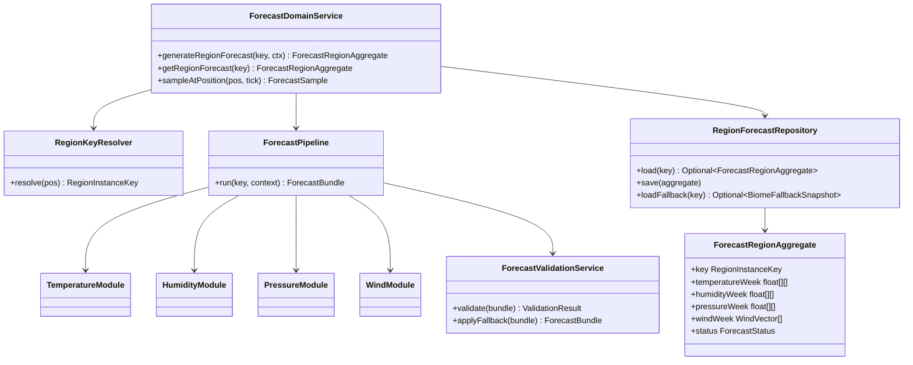
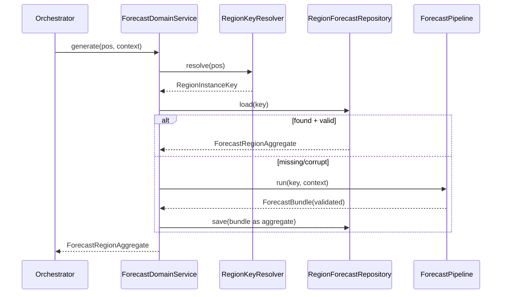
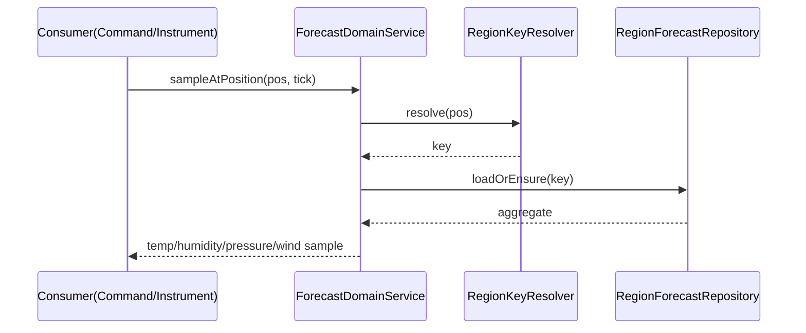
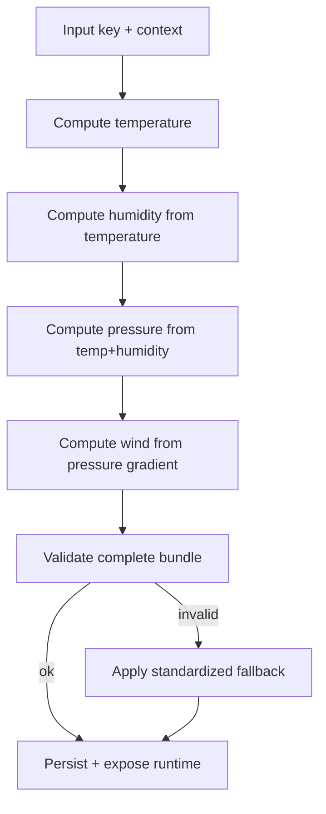

# Spécification technique — Refactorisation du Forecast System (Phase 1)

## 1) Résumé exécutif

Le système forecast actuel est **hybride** :
- une chaîne legacy centrée sur `BiomeInstanceKey`/`BiomeForecast` (génération, stockage, fallback) ;
- une chaîne régionale (`RegionInstanceKey`, `ForecastRegion`, `RegionForecastOrchestrator`) déjà introduite mais encore dépendante des données biome legacy.

La Phase 1 formalise une cible d’architecture claire, documente les dysfonctionnements (null safety, duplication, responsabilités mixtes) et définit un plan de migration vers un modèle **Region-first**.

---

## 2) Analyse de l’existant (diagnostic)

### 2.1 Composants clés recensés

#### Orchestration et génération
- `ForecastOrchestrator` : cycle serveur (start/stop/login/regénération), couplage aux systèmes dynamiques et à l’orchestrateur régional.
- `ForecastGenerator` : sampling biomes, génération forecast hebdo (temp/humidity/pressure/wind), agrégations moyennes, fallback legacy, construction de `REGION_FORECASTS`.

#### Modules de variable
- Température : via `TemperatureGenerator` (appelé par `ForecastGenerator`).
- Humidité : `HumidityGenerator` (dépend de la température forecast).
- Pression : `PressureGenerator` (dépend de température + humidité forecast).
- Vent : `WindGenerator` (dépend de pression + voisinage + densité de l’air).

#### Couche régionale (en transition)
- `RegionForecastOrchestrator`, `GridRegionIndex`, `ForecastRegion`, `FileRegionPersistence`, `BiomeForecastSnapshot`, `BiomeFallbackSnapshot`.
- Bootstrapping temporaire via `RegionOrchestratorBootstrap` + `LegacyBiomeForecastGenerator`.

#### Clés et structures
- `BiomeInstanceKey` (biome + position échantillon).
- `RegionInstanceKey` (coordonnées de région + taille grille).

#### Stockage
- Legacy : `ForecastDataStorage` sérialise la map biome forecast (`biome_forecasts.json`) + centres joueurs.
- Régional : `FileRegionPersistence` stocke les snapshots fallback par région.

### 2.2 Problèmes structurels observés

1. **Double modèle de clés en runtime**
   - Le runtime utilise à la fois `BiomeInstanceKey` et `RegionInstanceKey`, avec des adapters intermédiaires.
   - Conséquence : résolution de forecast non triviale, chemins d’accès multiples, et erreurs de mapping possibles.

2. **Responsabilités trop larges dans `ForecastGenerator`**
   - Sampling, génération multi-modules, agrégation, fallback, envoi réseau, et construction régionale sont mélangés dans une même classe.

3. **Duplication de logique**
   - Génération slice régionale dupliquée (`RegionOrchestratorBootstrap` anonyme vs `LegacyBiomeForecastGenerator`).
   - Conversion position->local région présente à plusieurs endroits (`RegionAdapters` et orchestrateur régional).
   - Patterns d’agrégation moyenne présents dans plusieurs classes (legacy et région).

4. **Null handling hétérogène**
   - Plusieurs chemins retournent des tableaux vides, valeurs neutres ou fallback implicite selon module.
   - Risque d’incohérences entre modules quand une donnée intermédiaire est absente.

5. **Pipeline forecast peu lisible**
   - L’ordre des dépendances est implicite (temp -> humidity -> pressure -> wind), piloté par side-effects de maps globales.

6. **Couplage fort aux singletons statiques**
   - Les modules tirent des données depuis des registres/maps statiques globaux, rendant les flux et tests plus difficiles.

### 2.3 Causes probables des forecasts null / incohérents

- Échantillonnage vide (ex. zones sous niveau mer, filtrage de biomes), produisant peu/pas de `BiomeInstanceKey`.
- Forecast absent pour une clé, puis fallback incomplet/non homogène entre variables.
- Ordonnancement implicite des passes (humidity/pressure/wind) dépendant d’un état global intermédiaire.
- Chargement persistant partiel ou ancien format (legacy), produisant des courbes incomplètes.

---

## 3) RDCU — Recensement des cas d’utilisation

### UC-01 Générer un forecast de région
- **Acteurs** : Orchestrateur serveur, service forecast.
- **Entrée** : position centre + niveau serveur + jour/seed.
- **Sortie** : `ForecastRegion` valide (curves temp/humidity/pressure/wind).
- **Flux principal** :
  1. Résoudre `RegionInstanceKey`.
  2. Obtenir les biomes source de la région.
  3. Générer les courbes de base (temp), puis dépendantes (humidity, pressure, wind).
  4. Agréger et clore un objet `ForecastRegion`.
  5. Persister fallback régional.
- **Erreurs** : aucun biome source, snapshot corrompu, dépendance module indisponible.

### UC-02 Récupérer un forecast courant
- **Acteurs** : instrument, commande debug, systèmes météo.
- **Entrée** : position monde + tick.
- **Sortie** : valeurs instantanées (temp/humidity/pressure/wind).
- **Flux principal** :
  1. Mapper position -> région.
  2. Charger région si absente (load/generate).
  3. Sampler les courbes.
- **Erreurs** : région absente/corrompue -> fallback contrôlé.

### UC-03 Mettre à jour dynamiquement l’état atmosphérique
- **Acteurs** : scheduler tick serveur.
- **Entrée** : tick courant + régions actives.
- **Sortie** : état atmosphérique évolué, cohérent inter-variables.
- **Flux principal** : appliquer contrôleurs dynamiques sur l’état régional (pas sur la donnée biome brute).
- **Erreurs** : état manquant, region inactive, données hors bornes.

### UC-04 Résoudre la clé de zone
- **Acteurs** : tous consommateurs runtime.
- **Entrée** : position monde.
- **Sortie** : `RegionInstanceKey`.
- **Flux principal** : transformation déterministe unique par grille.
- **Erreurs** : position nulle (retour erreur explicite).

### UC-05 Gérer absence de données
- **Acteurs** : orchestrateur régional.
- **Entrée** : clé région sans données actives.
- **Sortie** : région régénérée ou fallback valide.
- **Flux principal** : read fallback -> validation -> régénération si nécessaire.
- **Erreurs** : fallback illisible/corrompu.

### UC-06 Synchroniser modules forecast
- **Acteurs** : pipeline de génération.
- **Entrée** : clé région + contexte jour/saison.
- **Sortie** : paquet cohérent des 4 variables.
- **Flux principal** : exécution ordonnée des modules avec contrat d’interface explicite.
- **Erreurs** : module en échec -> stratégie de dégradation (valeurs neutres + traçabilité).

---

## 4) MDD — Modèle de domaine cible

## 4.1 Entités et responsabilités

- **ForecastDomainService**
  - façade applicative du pipeline forecast.
  - expose `generateRegionForecast`, `getRegionForecast`, `sampleAtPosition`.

- **RegionKeyResolver**
  - source unique de vérité pour la résolution de clé région.

- **RegionForecastRepository**
  - persistance `ForecastRegion` + fallback snapshots.
  - gère compatibilité de versions de format.

- **ForecastPipeline**
  - étapes immuables et ordonnées : Temperature -> Humidity -> Pressure -> Wind.

- **ForecastRegionAggregate**
  - racine de domaine runtime : courbes + métadonnées + état de validité.

- **ModuleComputeContext**
  - contexte partagé (seed/jour/saison/biome samples/contraintes).

- **ForecastValidationService**
  - bornes physiques, null safety, complétude des courbes.

## 4.2 Relations

- `ForecastDomainService` utilise `RegionKeyResolver`, `ForecastPipeline`, `RegionForecastRepository`.
- `ForecastPipeline` orchestre les 4 compute modules via un contrat commun.
- `ForecastRegionAggregate` est produit/validé avant persistance et exposition runtime.

## 4.3 Flux de données cible

1. Position -> `RegionInstanceKey`.
2. Repository charge/régénère l’agrégat régional.
3. Pipeline calcule toutes les variables dans un contexte unique.
4. Validation homogène + clamping + fallback standardisé.
5. Exposition runtime uniquement en clé région.

---

## 5) UML (Mermaid)

### 5.1 Diagramme de classes (cible)

### 5.2 Diagramme de séquence — génération

### 5.3 Diagramme de séquence — récupération runtime

### 5.4 Diagramme d’activité — pipeline forecast

---

## 6) Plan de restructuration (préparation Phase 2)

### 6.1 Structure cible

1. Introduire un package `modules.forecast.domain` (service, pipeline, validation, modèles).
2. Conserver `modules.region` pour la projection spatiale et la persistance régionale.
3. Basculer les consommateurs runtime sur une API régionale unique.

### 6.2 Fusion des duplications

- Remplacer le générateur anonyme de `RegionOrchestratorBootstrap` par `LegacyBiomeForecastGenerator` unique.
- Centraliser la conversion monde->local région dans un seul utilitaire/service.
- Factoriser les méthodes d’agrégation/clamping des courbes dans un composant commun.

### 6.3 Migration vers `RegionInstanceKey`

- **Étape A** : API read-only region-first (adapters legacy conservés).
- **Étape B** : stockage principal par région ; legacy uniquement en import/migration.
- **Étape C** : suppression progressive des accès runtime par `BiomeInstanceKey`.
- **Étape D** : nettoyage final des adapters legacy.

### 6.4 Stratégie de migration du code existant

- Strangler pattern : nouvelles façades region-first en parallèle du legacy.
- Feature flags de migration (lecture/écriture).
- Journalisation structurée des fallbacks et corruptions.
- Vérification par snapshots de cohérence avant suppression legacy.

### 6.5 Risques techniques

- Divergence de valeurs pendant coexistence dual-stack.
- Régression perf sur chargements régionaux massifs.
- Risques de compatibilité des données de sauvegarde.
- Couplage implicite de certains systèmes dynamiques encore biome-centric.

Mitigations : tests de non-régression des bornes, métriques télémetrie, migration incrémentale par module.

---

## 7) Matrice de conformité aux objectifs

- **Architecture clarifiée** : modèle domaine + pipeline explicite + responsabilité par service.
- **Duplications adressées** : points de duplication listés + plan de fusion.
- **Stabilisation forecast** : causes null identifiées + stratégie validation/fallback homogène.
- **Transition RegionInstanceKey** : roadmap en 4 étapes avec dépréciation progressive biome.
- **Maintenabilité** : séparation domaine/persistance/résolution clé + interfaces explicites.

