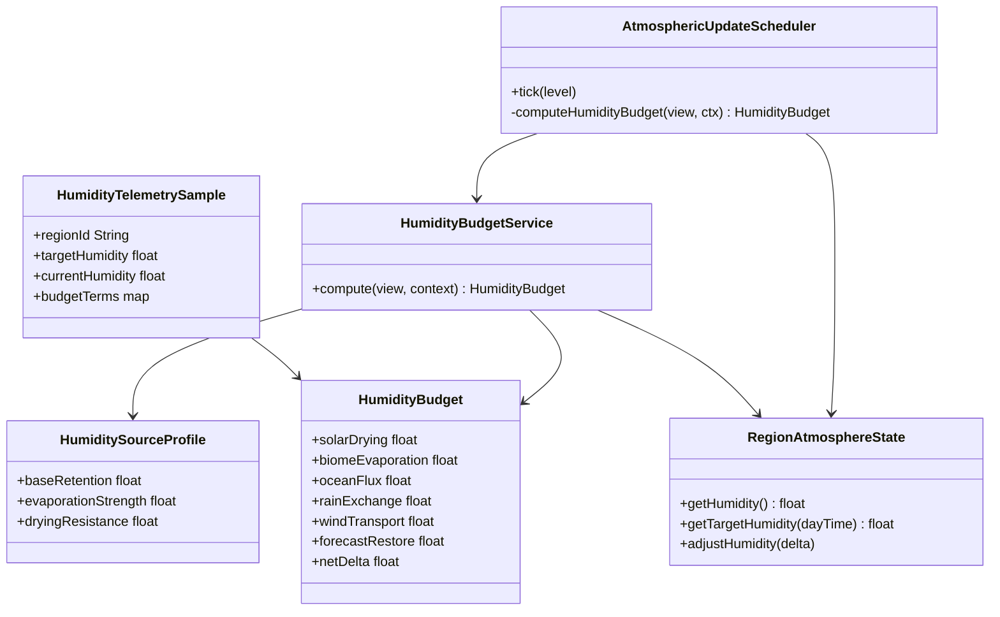
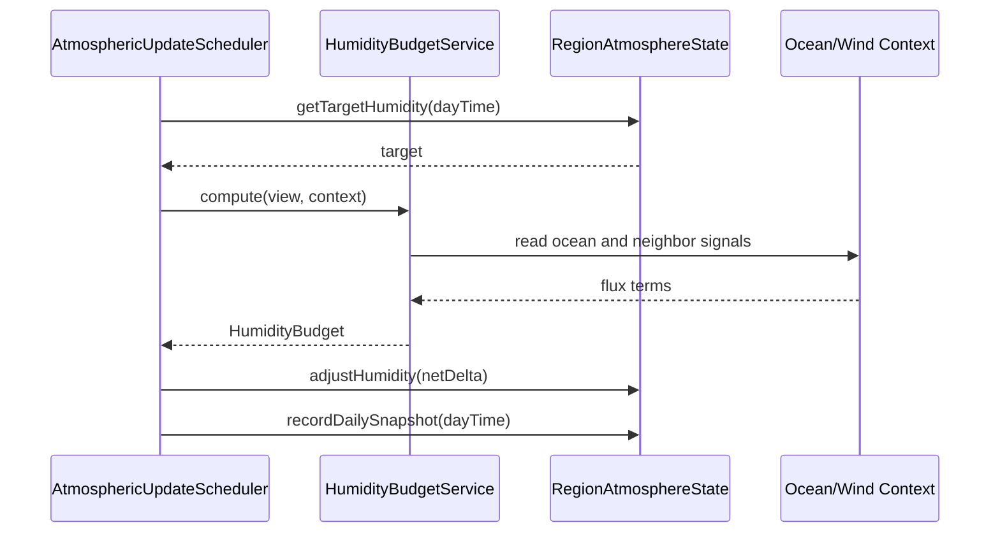
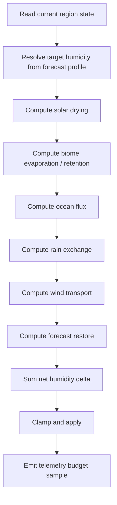
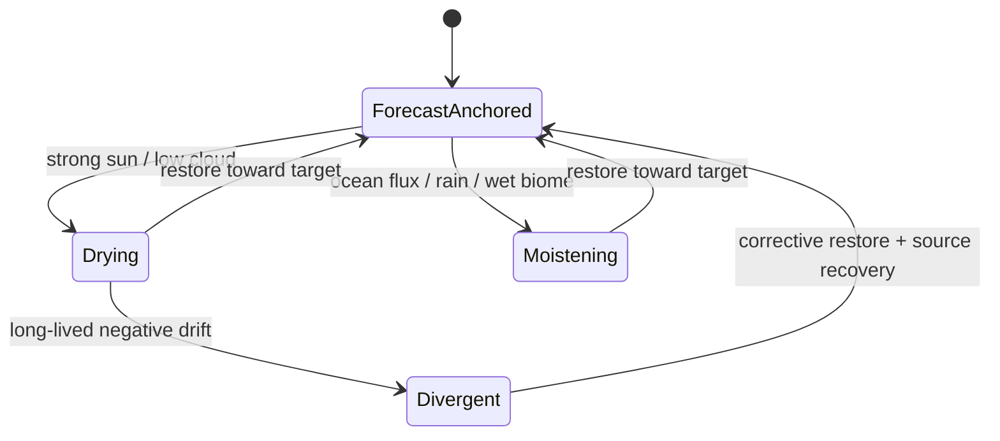

# Specification technique - Refonte de l'humidite runtime par budget d'humidite

## 1) Resume executif

L'etat actuel de l'humidite runtime est base sur des deltas heuristiques :
- l'ensoleillement seche l'air ;
- la pluie retire aussi de l'humidite ;
- un `relaxTowardBase` tres faible tente ensuite de rapprocher l'etat courant de sa base.

Ce modele fonctionne pour produire des variations simples, mais il diverge de la climatologie forecast dans les biomes humides. La telemetrie du run `a6e0ad` montre qu'une region de jungle en `EARLY_SPRING` peut tomber d'environ `60%` RH a `30%` RH alors que sa bande forecast reste autour de `53%..67%`.

La cible proposee est un modele **hybride budget d'humidite + ancrage climatologique** :
- budget explicite des sources, puits et transports d'humidite ;
- conservation locale approximative a l'echelle de la region ;
- retour controle vers la courbe forecast journaliere pour stabiliser le systeme ;
- separation conceptuelle entre humidite d'air et phenomenes precipitant, avec possibilite d'introduire plus tard un stock de `cloud water`.

Cette approche remplace le modele "heuristiques libres + micro-correction" par un modele "climat guide + ecarts transitoires explicables".

---

## 2) Vision produit / architecture

### 2.1 Vision

Le systeme d'humidite doit produire un comportement qui soit :
- **credible** : jungle, marais, mangrove et zones oceaniques restent humides sans hard floor arbitraire ;
- **reactif** : une journee claire et ventee peut assecher localement l'air ;
- **coherent** : les etats runtime restent dans le voisinage de la climatologie forecast ;
- **expliquable** : chaque variation peut etre rattachee a une source, un puits, un transport ou une restauration ;
- **instrumentable** : la telemetrie doit permettre de decomposer les deltas et d'identifier rapidement un terme instable.

### 2.2 Principe de conception

Le forecast regional represente la **climatologie cible**.

Le runtime represente la **meteo locale transitoire**.

L'humidite runtime n'est donc ni :
- une simple lecture directe de la courbe forecast ;
- ni une simulation totalement libre sans ancrage.

Elle doit etre calculee comme :

`humidite(t+1) = humidite(t) + sources - puits + transport + restauration_vers_cible`

avec :
- `sources` : evaporation oceanique, evapotranspiration biome, rehumidification locale ;
- `puits` : sechement solaire, eventuellement precipitation nette, subsidence future si necessaire ;
- `transport` : advection / diffusion par le vent et les voisins ;
- `restauration_vers_cible` : terme de stabilisation vers la courbe forecast du moment.

### 2.3 Positionnement par rapport au refactor forecast

Cette refonte ne remplace pas le modele Region-first deja en place. Elle le prolonge :
- la region reste l'unite de simulation ;
- la courbe forecast d'humidite de la region devient la cible climatique ;
- les systemes ocean, vent, cloud et scheduler deviennent les producteurs/consommateurs de deltas de budget.

---

## 3) Analyse de l'existant (diagnostic)

### 3.1 Constat runtime

Chemin principal actuel :
- `ForecastOrchestrator.tick(...)`
- `AtmosphericUpdateScheduler.tick(...)`
- `AtmosphericUpdateScheduler.computeDeltas(...)`
- `RegionAtmosphereState.adjustHumidity(...)`
- `RegionAtmosphereState.relaxTowardBase(...)`

Problemes observes :
1. **La pluie se comporte comme un puits d'humidite**
   - `rainHumidityDelta = -clampedRain * HUMIDITY_DRAIN * mode.scale()`
   - ce choix est contre-intuitif pour l'humidite proche surface.

2. **Le sechement solaire est global et biome-agnostique**
   - la meme formule retire de l'humidite a tous les biomes ;
   - aucun terme n'exprime la retention des biomes humides.

3. **Le retour vers la base est trop faible**
   - `relaxTowardBase` corrige peu ;
   - les ecarts accumules dominent la dynamique.

4. **La cible climatique du moment n'est pas exploitee**
   - `RegionAtmosphereState` stocke deja `dailyHumidityProfile` ;
   - le scheduler n'utilise pourtant pas cette courbe comme cible runtime.

5. **Le systeme n'a pas de decomposition explicite**
   - il est difficile de savoir, a posteriori, quelle part de la baisse vient du soleil, du vent, de la pluie, de l'ocean ou d'une divergence cumulative.

### 3.2 Constat forecast

Le forecast d'humidite est deja structure de maniere utile :
- `HumidityGenerator` derive une base RH du biome ;
- les biomes tropicaux sont proteges par `MIN_HUMIDITY_TROPICAL_BIOME = 75f` ;
- le forecast hebdomadaire fournit une bande min/max interpretable.

Conclusion :
- le coeur du probleme n'est pas l'initialisation forecast ;
- le coeur du probleme est la **dynamique runtime non ancree**.

### 3.3 Etude de cas telemetrie

Run observe :
- session telemetrie `a6e0ad`
- saison detectee : `EARLY_SPRING`

Cas le plus parlant :
- region `region[-1,-1]@2000`
- biome dominant : `minecraft:jungle`
- forecast humidite : `53.3%..66.6%`
- humidite runtime :
  - debut : `59.95%`
  - plus tard : `29.74%`
  - fin de plage observee : `29.98%`

Lecture systemique :
- la jungle part d'un niveau plausible ;
- le runtime derive loin sous sa propre enveloppe forecast ;
- aucun terme fort ne la fait remonter ensuite.

### 3.4 Conclusion de diagnostic

Le modele actuel souffre d'un **defaut de structure** plus que d'un simple mauvais coefficient.

Un patch purement numerique ameliorerait un run, mais ne fournirait ni :
- une explication stable ;
- ni une base de tuning durable ;
- ni une telemetrie assez riche pour fiabiliser le systeme.

---

## 4) Etude de solutions

### 4.1 Option A - Ajustement de constantes

- Changer `HUMIDITY_DRAIN`, `relaxFactor`, `sunlightFactor`.

Avantages :
- rapide ;
- faible risque de regressions structurelles.

Limites :
- traite les symptomes ;
- ne rend pas le modele interpretable ;
- ne distingue pas biomes humides / arides ;
- restera fragile apres de futurs changements cloud/ocean/wind.

### 4.2 Option B - Hard floors biome-specifiques

- imposer un minimum RH par biome ou famille de biome.

Avantages :
- simple ;
- visible immediatement.

Limites :
- solution artificielle ;
- difficile a maintenir ;
- incoherente avec le forecast ;
- masque les bugs plutot qu'elle ne les corrige.

### 4.3 Option C - Runtime forecast-anchor seulement

- la courbe forecast devient la cible principale ;
- les deltas runtime restent heuristiques.

Avantages :
- beaucoup plus stable ;
- compatible avec l'architecture actuelle.

Limites :
- meilleur que l'existant, mais encore peu explicable ;
- ne formalise pas vraiment les sources et puits.

### 4.4 Option D - Budget d'humidite complet

- sources, puits, transport, consommation/production explicites ;
- eventuelle extension future vers `cloud water`.

Avantages :
- meilleur cadre de simulation ;
- facilite les diagnostics ;
- meilleure extensibilite ;
- comportement biome/ocean plausible sans hard floors.

Limites :
- cout d'implementation plus eleve ;
- risque de derive si le systeme est "pur" sans ancrage climatologique.

### 4.5 Decision retenue

L'option recommandee est **D hybride** :
- budget d'humidite explicite ;
- ancrage forecast obligatoire ;
- pas de conservation physique stricte a l'echelle monde ;
- stabilisation locale par la climatologie region-first.

Autrement dit : **simulation inspiree de la physique, mais bornee par le design runtime du mod**.

---

## 5) RDCU - Recensement des cas d'utilisation

### UC-01 Evaluer la cible climatique d'humidite
- **Acteurs** : scheduler atmospherique, debug, telemetrie.
- **Entree** : `RegionInstanceKey`, `dayTime`.
- **Sortie** : humidite cible normalisee `0..1.2`.
- **Flux principal** :
  1. Charger l'etat regional.
  2. Lire le profil journalier forecast.
  3. Interpoler la cible au tick courant.

### UC-02 Calculer le budget d'humidite d'une region
- **Acteurs** : scheduler.
- **Entree** : vue d'etat region, contexte tick, voisins.
- **Sortie** : decomposition `sources`, `puits`, `transport`, `restore`.
- **Flux principal** :
  1. Evaluer le sechement solaire.
  2. Evaluer les apports biome/ocean.
  3. Evaluer la contribution pluie/cloud.
  4. Evaluer les echanges avec voisins.
  5. Evaluer le retour vers la cible forecast.

### UC-03 Mettre a jour l'humidite runtime
- **Acteurs** : scheduler.
- **Entree** : budget calcule.
- **Sortie** : humidite region mise a jour et clampee.
- **Flux principal** :
  1. Appliquer le delta net.
  2. Clamper l'humidite.
  3. Enregistrer la telemetrie de budget si active.

### UC-04 Diagnostiquer une divergence forecast/runtime
- **Acteurs** : telemetrie, commande debug, developpeur.
- **Entree** : region, tick.
- **Sortie** : ecart forecast/runtime + decomposition causale.
- **Flux principal** :
  1. Comparer humidite courante a la cible.
  2. Lire les termes du budget.
  3. Identifier le terme dominant de divergence.

### UC-05 Simuler des biomes de nature differente
- **Acteurs** : scheduler runtime.
- **Entree** : region jungle, marais, cote, desert, montagne.
- **Sortie** : reponse hygrometrique differenciee.
- **Flux principal** :
  1. Deriver une force de source biome.
  2. Moduler le sechement selon le contexte.
  3. Conserver un comportement distinct sans hard floor.

### UC-06 Etendre plus tard vers cloud water
- **Acteurs** : futur module clouds.
- **Entree** : humidite de l'air, cloud cover, pluie.
- **Sortie** : stock de vapeur / eau nuageuse plus riche.
- **Flux principal** :
  1. Convertir une partie de l'humidite disponible en condensat.
  2. Alimenter precipitation et epaisseur nuageuse.
  3. Reinjecter une part vers la basse atmosphere.

---

## 6) MDD - Modele de domaine cible

### 6.1 Concepts de domaine

- **HumidityClimatologyTarget**
  - cible issue de la courbe forecast journaliere.

- **HumidityBudget**
  - objet de calcul contenant les termes :
    - `solarDrying`
    - `biomeEvaporation`
    - `oceanFlux`
    - `rainExchange`
    - `windTransport`
    - `forecastRestore`
    - `netDelta`

- **HumiditySourceProfile**
  - profil de production/retenue d'humidite pour une region.
  - derive du biome dominant, de l'humidite forecast et, si disponible, du contexte oceanique.

- **HumidityRuntimePolicy**
  - regles de calcul et de clamping pour l'humidite runtime.

- **HumidityBudgetService**
  - service applicatif qui calcule le budget d'une region a un tick donne.

- **HumidityTelemetrySample**
  - projection telemetrique de la decomposition budgetaire.

### 6.2 Responsabilites

- `RegionAtmosphereState`
  - stocke l'humidite courante ;
  - expose la cible journaliere forecast ;
  - conserve les profils journaliers utiles au runtime.

- `AtmosphericUpdateScheduler`
  - appelle un service de budget ;
  - applique les deltas de temperature/humidite/pression ;
  - journalise les anomalies.

- `HumidityBudgetService`
  - calcule les termes du budget d'humidite ;
  - ne persiste rien ;
  - ne lit pas d'etat global cache hors de ses entrees.

- `Ocean influences`
  - alimentent un terme explicite `oceanFlux`.

- `Wind mixing`
  - alimente un terme explicite `windTransport`.

### 6.3 Invariants

1. L'humidite runtime doit rester dans `0..1.2`.
2. La cible climatologique doit toujours etre disponible ou remplacable par une valeur de base.
3. La pluie ne doit pas se comporter comme un puits net par defaut.
4. Les biomes humides doivent posseder une source ou retention > biomes arides.
5. Un ecart prolongé forecast/runtime doit etre observable en telemetrie.

### 6.4 Equation cible

Forme proposee :

`H(t+1) = H(t) + E_biome + F_ocean + X_rain + T_wind - D_solar - S_precip + R_forecast`

avec :
- `E_biome` : evapotranspiration / humidite de fond du biome ;
- `F_ocean` : flux marin/cotier ;
- `X_rain` : effet local de rehumidification pres-surface ;
- `T_wind` : transport net voisin -> region ;
- `D_solar` : sechement solaire selon soleil, couverture nuageuse, saison ;
- `S_precip` : puits precipitation, optionnel et faible dans la premiere iteration ;
- `R_forecast` : rappel vers la cible forecast.

Pour la premiere tranche :
- `S_precip` peut etre nul ou tres faible ;
- `X_rain` doit etre positif ;
- `R_forecast` est obligatoire.

---

## 7) UML (Mermaid)

### 7.1 Diagramme de classes

### 7.2 Diagramme de sequence - update d'humidite

### 7.3 Diagramme d'activite - budget d'humidite

### 7.4 Diagramme d'etats simplifie

---

## 8) Cas d'etude de reference pour le design

### 8.1 Jungle continentale

Attendu :
- humidite elevee de fond ;
- baisse diurne possible ;
- retour rapide vers une cible humide ;
- pas de collapse durable a `30%` sans cause extreme.

Budget dominant :
- `biomeEvaporation` fort ;
- `forecastRestore` moyen a fort ;
- `solarDrying` present mais non dominant durablement.

### 8.2 Marais / mangrove

Attendu :
- humidite tres elevee ;
- forte resistance au sechement ;
- couplage fort avec pluie et nuages.

Budget dominant :
- `biomeEvaporation` fort ;
- `oceanFlux` ou flux aquatique eleve ;
- `solarDrying` amorti.

### 8.3 Desert / badlands

Attendu :
- faible humidite de fond ;
- sechement diurne fort ;
- faible restauration humide.

Budget dominant :
- `solarDrying` fort ;
- `biomeEvaporation` faible ;
- `forecastRestore` vers une cible deja seche.

### 8.4 Cote / ocean

Attendu :
- humidite moderee a elevee ;
- recuperation rapide apres episode sec ;
- bon support a la formation nuageuse.

Budget dominant :
- `oceanFlux` fort ;
- `forecastRestore` modere ;
- `windTransport` important.

### 8.5 Montagne froide / peaks

Attendu :
- humidite possible mais temperature basse ;
- pluie/neige et nuages frequents selon contexte ;
- pas de confusion entre froid et air sec absolu.

Budget dominant :
- cible forecast froide ;
- effet precipitant possible ;
- sechement solaire plus faible si couverture nuageuse forte.

---

## 9) Plan d'implementation propose

### Phase A - Instrumentation

Objectif :
- rendre le systeme observable avant de changer les equations.

Travaux :
1. Introduire une structure `HumidityBudget`.
2. Emettre une telemetrie de decomposition par region echantillonnee.
3. Exposer la cible forecast journaliere dans `RegionAtmosphereState`.

Resultat attendu :
- pouvoir expliquer une divergence sans speculation.

### Phase B - Refonte du scheduler humidite

Objectif :
- remplacer la formule actuelle par un budget explicite.

Travaux :
1. Remplacer le terme de pluie negatif par un `rainExchange` positif.
2. Ajouter `forecastRestore` vers la cible journaliere.
3. Introduire `HumiditySourceProfile` derive du biome dominant et/ou de la base forecast.
4. Garder les clamps existants en dernier filet de securite.

Resultat attendu :
- jungle/marais stabilises sans floors arbitraires ;
- desert conserve un comportement sec.

### Phase C - Integration ocean/wind propre

Objectif :
- rendre explicites les contributions transverses.

Travaux :
1. Faire remonter les contributions ocean sous forme de `oceanFlux`.
2. Distinguer clairement `windTransport` du simple bruit de diffusion.
3. Ajuster le scheduler pour sommer des termes nommes plutot que des deltas implicites.

### Phase D - Extension future cloud water

Objectif :
- enrichir le modele sans casser l'architecture.

Travaux :
1. Introduire un stock `cloudWater` optionnel.
2. Convertir humidite disponible -> condensation -> pluie.
3. Reinjecter un effet local sur la basse atmosphere.

Cette phase est volontairement differee.

---

## 10) Risques techniques et mitigations

### Risque 1 - Sur-correction vers la cible forecast

Effet :
- meteo trop rigide, peu de variabilite.

Mitigation :
- `forecastRestore` doit etre borne ;
- conserver des deltas transitoires significatifs ;
- comparer variance avant/apres via telemetrie.

### Risque 2 - Double comptage ocean / pluie / cloud

Effet :
- emballement humide artificiel.

Mitigation :
- expliciter chaque terme ;
- verifier les runs cotiers et marins ;
- garder une telemetrie par terme.

### Risque 3 - Deserts trop humides apres correction

Effet :
- perte de contraste biome.

Mitigation :
- deriver la restauration depuis la cible climatologique ;
- source biome faible pour les biomes arides ;
- profils humides et secs distingues.

### Risque 4 - Cout CPU accru

Effet :
- scheduler plus cher.

Mitigation :
- rester sur des calculs scalaires simples ;
- reutiliser les etats/voisins deja disponibles ;
- n'instrumenter finement qu'en mode telemetrie.

---

## 11) Criteres d'acceptation

### 11.1 Criteres fonctionnels

- Une jungle ne doit plus pouvoir rester durablement autour de `30%` RH si sa cible forecast est `> 50%` sans cause transitoire forte.
- Un desert doit rester nettement plus sec qu'une jungle sur une meme plage de temps.
- Une region cotiere doit recuperer son humidite plus vite qu'une region continentale aride.
- La pluie ne doit plus agir comme puits d'humidite par defaut.

### 11.2 Criteres telemetrie

- Chaque echantillon debug/telemetrie doit pouvoir exposer :
  - `targetHumidity`
  - `currentHumidity`
  - `solarDrying`
  - `biomeEvaporation`
  - `oceanFlux`
  - `rainExchange`
  - `windTransport`
  - `forecastRestore`
  - `netDelta`

### 11.3 Criteres de maintenance

- Le calcul d'humidite doit etre lisible par termes nommes.
- Les futures integrations cloud/ocean ne doivent pas reintroduire des deltas anonymes.
- Les consommateurs runtime ne doivent pas avoir a connaitre les details du budget.

---

## 12) Decision d'architecture

La refonte humidite doit partir sur un **budget d'humidite hybride, region-first et forecast-anchor**.

Ce choix :
- corrige la divergence observee en jungle ;
- garde une base climatique stable ;
- reste compatible avec le runtime region-first deja migre ;
- prepare une evolution propre vers un modele nuage/pluie plus riche ;
- evite les hard floors et le tuning opaque.

Ce document sert de reference de conception avant implementation.
