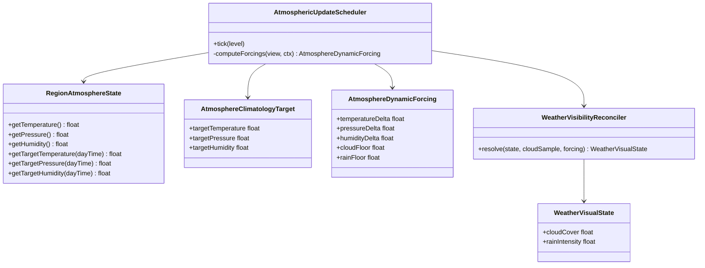
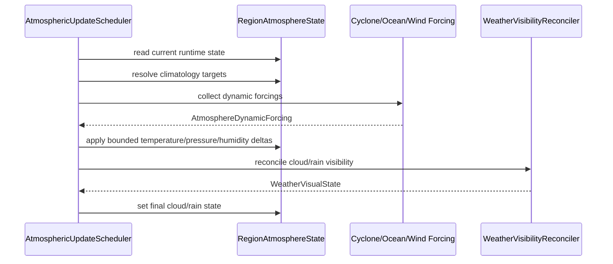
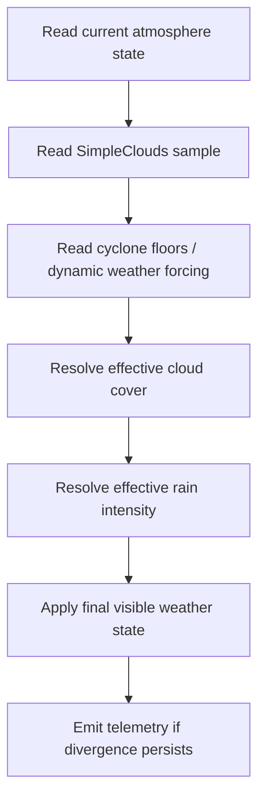
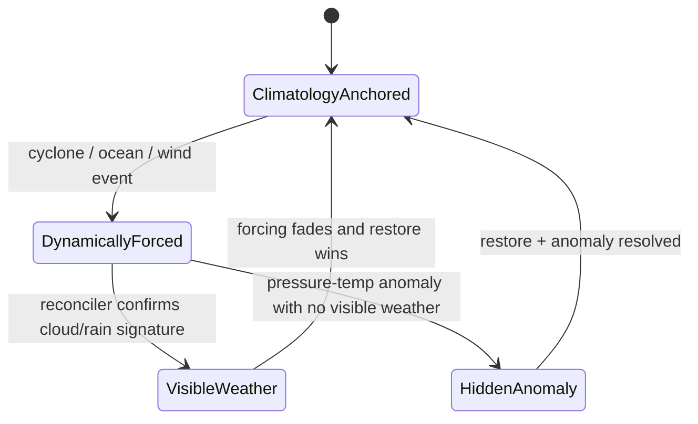

# Specification technique - Etude de cas sur le couplage runtime temperature, pression et weather visible

## 1) Resume executif

Les telemetries recentes montrent que le probleme runtime ne se limite pas a l'humidite :
- certaines regions chaudes derivent durablement sous leur propre bande forecast de temperature ;
- certaines regions passent en basse pression marquee sans manifestation coherente cote clouds/rain ;
- la couche de weather visible reste quasi inerte alors que des etats dynamiques forts existent dans l'atmosphere runtime.

Le symptome n'est pas un simple mauvais coefficient. Le coeur du probleme est un **defaut de couplage entre etat atmospherique, forecast climatologique et visualisation meteorologique**.

La cible de cette etude est un modele de runtime ou :
- le forecast reste la climatologie de reference ;
- temperature, humidite et pression vivent comme des deviations bornees autour de cette climatologie ;
- les forcages dynamiques (cyclone, ocean, wind mixing) sont explicites ;
- la couche cloud/rain ne peut plus ecraser silencieusement l'etat atmospherique ;
- les anomalies de temperature/pression sans meteo visible deviennent impossibles ou, au minimum, telemetries et explicables.

Cette etude de cas sert de base de conception avant implementation.

---

## 2) Vision produit / architecture

### 2.1 Vision

Le runtime meteorologique doit produire un monde ou :
- un biome chaud reste chaud sauf forcage transitoire fort ;
- une basse pression durable s'accompagne d'une signature meteorologique observable ou d'une justification explicite ;
- les clouds visuels et les etats atmosphere ne se contredisent pas ;
- les deviations par rapport au forecast sont voulues, lisibles et temporaires.

### 2.2 Principe directeur

Le forecast est la **climatologie cible**.

Le runtime est la **deviation meteorologique transitoire**.

Pour chaque variable principale :

`etat_runtime = cible_forecast + somme_des_forcages_dynamiques + mecanisme_de_retour`

Variables concernees :
- temperature ;
- pression ;
- humidite ;
- cloud cover / rain intensity comme projection visible de l'etat runtime.

### 2.3 Regle d'architecture

Il ne doit plus y avoir plusieurs systemes ecrivant le meme concept sans contrat clair.

En particulier :
- `CycloneManager` ne doit pas pouvoir imposer un etat storm-like que `CloudManager` annule ensuite silencieusement ;
- `CloudManager` doit devenir soit :
  - la projection visuelle d'un etat atmospherique deja decide ;
  - soit un producteur formellement reconcilie avec les autres sources.

---

## 3) Analyse de l'existant (diagnostic)

### 3.1 Symptomes observes en telemetrie

#### Cas A - Region chaude trop froide

Dans la region `region[0,-1]@2000` a biome dominant `minecraft:badlands`, la bande forecast de temperature reste autour de `16.0C..26.7C`, mais l'etat runtime descend et reste vers `7.1C..9.7C` sur plusieurs echantillons et plusieurs jours.

Lecture :
- la generation forecast n'est pas en cause pour cette region ;
- c'est l'etat runtime qui s'eloigne durablement de sa cible.

#### Cas B - Basse pression sans weather visible coherent

Dans la region `region[-1,-1]@2000` a biome dominant `minecraft:jungle`, la pression runtime tombe vers `993.6..995.3 hPa` alors que la bande forecast reste vers `1006.8..1008.2 hPa`, avec pratiquement pas de pluie et tres peu de cloud cover visible.

Lecture :
- un forcage dynamique modifie bien la pression ;
- mais la couche weather visible ne suit pas.

#### Cas C - Cloud layer inerte

La telemetrie cloud montre un grand nombre de lignes sans precipitation active et avec intensite nulle. Cela peut etre une consequence du probleme humidity/cloud contract, mais dans le contexte actuel cela renforce l'impression d'un decouplage entre dynamique interne et rendu meteo observable.

### 3.2 Causes structurelles probables

1. **La pression n'a pas de vrai target restore forecast**
   - le scheduler ne recalcule pas une cible pression du moment ;
   - il n'existe pas de restauration forte vers une courbe pressure journaliere equivalente au forecast.

2. **Le contrat d'ecriture de cloud/rain est split-brain**
   - `CycloneManager` ecrit cloud/rain directement dans l'etat atmosphere ;
   - `CloudManager` reecrit ensuite `cloudCover` et `rainIntensity` depuis SimpleClouds ;
   - resultat possible : anomalie dynamique reelle, mais effacee visuellement.

3. **Les forcages temperature/pression sont plus forts que la correction de retour**
   - cyclone, ocean et wind mixing peuvent pousser l'etat ;
   - le retour forecast est trop faible ou absent selon la variable.

4. **La projection meteo visible depend trop de la couche cloud seule**
   - si la couche cloud n'est pas produite, les anomalies pressure/temperature restent "muettes".

### 3.3 Conclusion de diagnostic

Le systeme actuel ne souffre pas uniquement d'un mauvais tuning ; il manque un **modele de couplage runtime** entre :
- forecast climatologique ;
- etat atmospherique runtime ;
- forcages dynamiques ;
- projection visuelle clouds/rain.

---

## 4) Etude de solutions

### 4.1 Option A - Tuning de constantes seulement

Exemples :
- remonter `relaxFactor` ;
- baisser les deltas cyclone ;
- changer les seuils cloud.

Avantages :
- peu couteux ;
- utile pour debloquer un run.

Limites :
- ne traite pas le split-brain entre systems ;
- risque de casser un biome pour en reparer un autre ;
- ne cree aucune architecture durable.

### 4.2 Option B - Fix variable par variable

Exemples :
- patch temperature ;
- patch pressure ;
- patch clouds plus tard.

Avantages :
- progression incremental.

Limites :
- forte probabilite de reintroduire des incoherences ;
- aucune garantie que l'etat visible corresponde a l'etat interne.

### 4.3 Option C - Modele couple forecast + runtime + visualisation

Principe :
- chaque variable a une cible forecast ;
- chaque forcage est explicite ;
- une couche de reconciliation decide le weather visible final.

Avantages :
- traite la cause structurelle ;
- evolutif ;
- plus testable ;
- meilleur support telemetrie.

Limites :
- effort de conception superieur ;
- demande un contrat clair entre modules.

### 4.4 Decision retenue

L'option recommandee est **C**.

Le runtime doit devenir un **etat atmospherique pilote par forecast et soumis a des forcages explicites**, avec une **projection visuelle reconciliee**.

---

## 5) RDCU - Recensement des cas d'utilisation

### UC-01 Evaluer la cible runtime d'une variable
- **Acteurs** : scheduler.
- **Entree** : region, tick, variable.
- **Sortie** : temperature/pression/humidite cible.
- **Flux principal** :
  1. Lire la courbe forecast pertinente.
  2. Interpoler la cible au tick courant.
  3. Retourner la valeur cible.

### UC-02 Appliquer les forcages dynamiques
- **Acteurs** : scheduler runtime.
- **Entree** : etat courant, forcages cyclone/ocean/wind/cloud.
- **Sortie** : deviations runtime candidates.
- **Flux principal** :
  1. Evaluer les forcages entrants.
  2. Sommer les deltas par variable.
  3. Clamper ou pondrer selon politique runtime.

### UC-03 Reconciler cloud/rain avec l'atmosphere
- **Acteurs** : weather reconciliation service.
- **Entree** : etat atmosphere, etat SimpleClouds, forcing cyclone.
- **Sortie** : `effectiveCloudCover`, `effectiveRainIntensity`.
- **Flux principal** :
  1. Lire les contributions cloud externes.
  2. Lire les minima / floors dynamiques internes.
  3. Produire une valeur finale unique.

### UC-04 Detecter une divergence illegitime
- **Acteurs** : telemetrie, debug.
- **Entree** : etat runtime + cible forecast.
- **Sortie** : alerte de divergence structurelle.
- **Flux principal** :
  1. Mesurer l'ecart.
  2. Lire les forcages actifs.
  3. Signaler l'ecart si non justifie par un forcing connu.

### UC-05 Simuler un cyclone coherent
- **Acteurs** : `CycloneManager`, scheduler, cloud reconciler.
- **Entree** : cyclone actif.
- **Sortie** : baisse de pression, refroidissement local, signature cloud/rain visible coherente.
- **Flux principal** :
  1. Le cyclone applique ses forcages a l'etat atmosphere.
  2. Le reconciler conserve une empreinte visuelle minimale.
  3. La telemetrie expose le lien entre pressure drop et weather visible.

### UC-06 Recuperer un etat clear apres evenement
- **Acteurs** : scheduler runtime.
- **Entree** : fin de cyclone / fin de forcing.
- **Sortie** : retour progressif vers climatologie.
- **Flux principal** :
  1. Diminuer les forcages.
  2. Revenir vers les targets forecast.
  3. Faire disparaitre progressivement cloud/rain visibles.

---

## 6) MDD - Modele de domaine cible

### 6.1 Concepts de domaine

- **AtmosphereClimatologyTarget**
  - expose `targetTemperature`, `targetPressure`, `targetHumidity`.

- **AtmosphereDynamicForcing**
  - representation des forcages actifs :
    - `cycloneCooling`
    - `cyclonePressureDrop`
    - `oceanTemperatureFlux`
    - `oceanPressureFlux`
    - `windTransportTemperature`
    - `windTransportPressure`
    - `solarHeating`
    - `rainCooling`

- **AtmosphereRuntimeState**
  - etat vivant de la region :
    - `temperature`
    - `pressure`
    - `humidity`
    - `cloudCover`
    - `rainIntensity`

- **WeatherVisibilityReconciler**
  - service qui produit la projection visible finale.

- **AtmosphereDeviationPolicy**
  - regles de clamp, damping, garde-fous.

- **AtmosphereAnomalyClassifier**
  - service de detection d'ecarts non justifies.

### 6.2 Responsabilites

- `RegionAtmosphereState`
  - stocke l'etat runtime ;
  - expose les cibles forecast utilisees par le runtime.

- `AtmosphericUpdateScheduler`
  - calcule/applique les forcages par variable ;
  - delegue la reconciliation cloud/rain ;
  - declenche la telemetrie d'anomalie.

- `CycloneManager`
  - produit un forcing dynamique ;
  - ne doit plus etre un ecrivain final non reconcilie de la meteo visible.

- `CloudManager`
  - projette l'etat visible ;
  - ne doit plus effacer l'etat d'autres systemes sans contrat.

### 6.3 Invariants

1. Une variable runtime peut devier de sa cible, mais doit avoir un chemin clair de retour.
2. Une basse pression durable doit correspondre a un forcing actif connu ou etre signalee.
3. Le weather visible final doit provenir d'une seule decision reconciliee.
4. Les biomes chauds ne doivent pas rester durablement sous leur propre bande forecast sans forcing fort.
5. Les modules ne doivent plus se contredire silencieusement.

---

## 7) UML (Mermaid)

### 7.1 Diagramme de classes

### 7.2 Diagramme de sequence - tick runtime

### 7.3 Diagramme d'activite - reconciliation weather visible

### 7.4 Diagramme d'etats simplifie

---

## 8) Etudes de cas de reference

### 8.1 Badlands clair et sec

Attendu :
- temperature runtime proche de la bande forecast ;
- pression runtime plausible ;
- vent possible, mais sans refroidissement durable hors bande ;
- pas de pluie ni cloud cover forte.

Signal d'echec :
- region reste `6C..9C` sous la bande forecast sans forcing explicable.

### 8.2 Jungle sous basse pression

Attendu :
- humidite elevee ;
- baisse pression possible ;
- si la basse pression persiste, une signature cloud/rain ou storm likelihood doit apparaitre.

Signal d'echec :
- pression `~994 hPa` durable avec ciel presque vide et pluie nulle.

### 8.3 Cote influencee par l'ocean

Attendu :
- flux oceanique lisible ;
- pression et temperature derivees doucement vers l'etat marin ;
- formation cloud plus facile qu'en interieur aride.

Signal d'echec :
- ocean forcing fort sans aucune traduction visible ;
- ou refroidissement exagere d'un biome chaud adjacent.

### 8.4 Sortie d'evenement

Attendu :
- les forcages diminuent ;
- la meteo visible se dissipe progressivement ;
- temperature et pression reviennent vers leur cible.

Signal d'echec :
- cloud/rain disparaissent instantanement alors que pression/temp restent fortement perturbees ;
- ou inversement.

---

## 9) Plan d'implementation propose

### Phase A - Instrumentation et observabilite

Objectif :
- rendre explicite la deviation runtime en temperature et pression.

Travaux :
1. Ajouter `targetTemperature(dayTime)` et `targetPressure(dayTime)`.
2. Emettre une telemetrie de deviation runtime vs cible forecast.
3. Tagger les forcages actifs par region.

### Phase B - Pressure anchor

Objectif :
- empecher la pression de partir durablement sans correction.

Travaux :
1. Introduire un `forecastRestorePressure`.
2. Distinguer les deltas cyclone/ocean/wind des restores forecast.
3. Ajouter des garde-fous de divergence longue.

### Phase C - Weather visibility reconciliation

Objectif :
- supprimer le split-brain entre `CycloneManager` et `CloudManager`.

Travaux :
1. Introduire `WeatherVisibilityReconciler`.
2. Remplacer l'overwrite brutal par une decision unique.
3. Definir la priorite ou la fusion des floors dynamiques et des samples SimpleClouds.

### Phase D - Temperature damping

Objectif :
- empecher les biomes chauds de rester froids hors bande sans forcing fort.

Travaux :
1. Introduire un restore vers `targetTemperature`.
2. Telemetriser les cas hors bande prolonges.
3. Ajuster cyclone/ocean/wind pour qu'ils restent des forcages transitoires.

### Phase E - Validation croisee

Objectif :
- verifier la coherence forecast/runtime/visible.

Travaux :
1. Rejouer plusieurs sessions telemetrie.
2. Comparer biome chaud, jungle, cote, montagne.
3. Valider que les anomalies visibles et internes restent alignees.

---

## 10) Risques et mitigations

### Risque 1 - Weather visible trop rigide

Mitigation :
- reconciliation par bornes et floors, pas par hard override permanent.

### Risque 2 - Trop de restores forecast

Mitigation :
- restores faibles mais continus ;
- garder les forcages dynamiques explicites.

### Risque 3 - Complexite excessive

Mitigation :
- separer clairement :
  - calcul des forcages ;
  - update du state ;
  - projection visible.

### Risque 4 - Regressions cloud integration

Mitigation :
- commencer par telemetrie et reconcileur minimal ;
- ne pas remplacer SimpleClouds d'un coup.

---

## 11) Criteres d'acceptation

### 11.1 Temperature

- une region chaude ne doit plus rester durablement sous sa bande forecast sans forcing fort trace ;
- les deviations longue duree doivent etre telemetrees.

### 11.2 Pression

- une basse pression durable doit etre associee a un forcing cyclone/ocean connu ou revenir vers la cible ;
- les chutes > `8 hPa` sans meteo visible coherente doivent etre detectees.

### 11.3 Weather visible

- `cloudCover` et `rainIntensity` finaux doivent provenir d'une reconciliation unique ;
- il ne doit plus exister de storm-like state invisible par simple overwrite.

### 11.4 Maintenance

- chaque variable doit avoir un target climatologique clair ;
- chaque forcing doit etre nomme ;
- aucun module ne doit ecrire silencieusement un concept partage sans contrat.

---

## 12) Decision d'architecture

Le systeme doit evoluer vers un **modele de couplage runtime forecast-anchor + forcages explicites + reconciliation de weather visible**.

Ce choix :
- traite les anomalies temperature et pression observees ;
- prepare une integration plus saine avec la refonte humidite ;
- clarifie le contrat entre atmosphere interne et clouds visibles ;
- remplace le comportement emergent actuel par un comportement explicable et testable.

Ce document est la reference de conception pour la future refonte du couplage runtime temperature/pression/weather.
