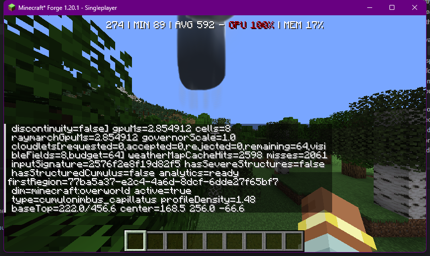
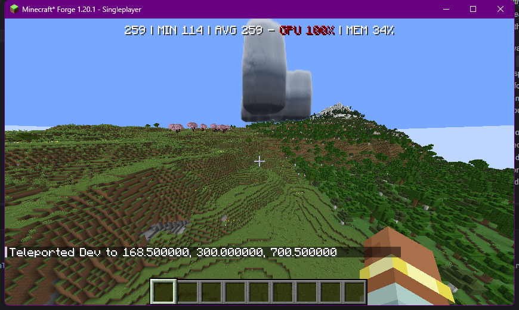

# Storm Structure Pipeline Investigation (2026-08-14)

Follow-up to `PA_VOLUMETRIC_LIVE_RENDER_AUDIT_2026-08-14.md`, Issue 2. This investigation answers
one question only, per the request that spawned it: **is the sophisticated multi-tier storm
structure system (`stormStructureShape()`, `StormStructureMap`/`StormLayerHeightMap`/
`StormTowerMap`) actually active in the live renderer?**

**Answer: No.** Confirmed by live diagnostic readout, not inferred. No silhouette code was changed
in this pass — this is diagnosis only, per the scope requested.

## Method

Static trace of the CPU pipeline first, then a **live** check: added a two-field, purely additive
diagnostic (`hasSevereStructures`, `hasStructuredCumulus`) to the existing
`CloudWeatherMapRenderer.cacheStatus()` string, which was already surfaced through
`/pa system cloudStatus`. Relaunched the dev client (Java change, not hot-reloadable), spawned
`cumulonimbus_capillatus`, and read the value straight from chat:

```
weatherMapCacheHits=2598 misses=2061 inputSignature=2576f2e8f19d82f5
hasSevereStructures=false
hasStructuredCumulus=false
```



Paired visual, same session, backed off to frame the whole storm:



The silhouette is a smooth flat-bottomed column with one attached blob — recognizably the
"cylinder/capsule cloud" shape that `PA_CLOUD_SHAPE_RESEARCH_VISUAL_REWORK_REPORT.md` (2026-06-15)
describes as a bug it fixed, in the *old*, now-deleted `cloud_volume.fsh`. That fix never carried
forward into the current `cloud_atmosphere_volume.fsh` weather-map pipeline in the same way — see
Finding 3.

## Findings, in the order requested

### 1. Does `useStormStructure` become true for a real spawned storm?

**No.** Live-confirmed via `hasSevereStructures=false` above.

### 2. `rolePresence` / `layerHeightPresence` / the three storm maps

`cloud_atmosphere_volume.fsh` gates the structured path with (~line 1817-1819):

```glsl
bool useStormStructure = stormProfile
    && rolePresence > 0.004
    && layerHeightPresence > 0.0001;
```

`rolePresence`/`layerHeightPresence` are built from `StormStructureMap`/`StormLayerHeightMap`/
`StormTowerMap` texel values. Those three textures are written by two dedicated fullscreen bake
passes — `cloud_weather_storm_structure.fsh` and `cloud_weather_storm_heights.fsh` — which decode a
packed `role` value out of `CellDynamics.w` per input cell and only accumulate into their output
channels for `role == 2` (BASE), `3` (CORE), `4` (TOWER), or `5` (ANVIL) (both files, ~line 73-82).
Any other role is skipped with `continue`. There is no "generic/legacy" contribution — an
unclassified cell contributes literally nothing to these textures.

### 3. CPU-side code generating and uploading those textures

Traced fully, `CloudWeatherMapRenderer.java`:

- `dynamicsArray[base + 3] = cell.cloudProfile() + cell.envelopeRole().gpuId() / 16.0F;` (~line
  307) — this is where `CellDynamics.w`'s role fraction comes from: directly off
  `VolumetricRenderCell.envelopeRole()`.
- `hasSevereStructures` is computed in the same loop (~line 316-319): true only if some cell has
  `cloudProfile() in {4,7}` **and** `envelopeRole().gpuId()` inside the `[BASE, ANVIL]` range.
- That boolean then gates whether the three bake passes run at all (~line 479, 495, 516):
  `VolumetricCloudRenderTargets.clearAndBind(...)` always clears the target; the shader draw is
  skipped entirely when `hasSevereStructures` is false. **The GPU passes never execute** for a
  storm without a structurally-roled cell — the textures aren't just empty, the draw call that
  would fill them doesn't happen.

Tracing where `envelopeRole()` actually gets assigned a real structural value
(`VolumetricRenderCell.java`):

- `fromFieldSnapshot(...)` (~line 83-177, the path used for a field with **zero** cloudlets) always
  assigns `EnvelopeRole.CARRIER_ONLY` or `EnvelopeRole.MACRO` (line 177) — **never** BASE/CORE/
  TOWER/CROWN/ANVIL.
- `fromFieldCloudlet(...)` (~line 280-366) is the **only** path that assigns a real structural role,
  via `EnvelopeRole.fromCloudletRole(cloudlet.role())` (line 366) — i.e. only individual cloudlets
  can carry BASE/CORE/TOWER/CROWN/ANVIL.

And cloudlet count, `VolumetricCloudRenderHook.requestedCloudletCount()` (~line 601-610):

```java
if (snapshot == null || !snapshot.hasVisibleClouds()
        || snapshot.sourceKind() == CloudFieldSourceKind.PA_CLUSTER) {
    return 0;
}
```

**Every `PA_CLUSTER`-sourced field requests zero cloudlets, unconditionally.** This isn't an
oversight — `CloudFieldFactory.cloudletCountFor()` has the design rationale in a comment:

```java
// PA clusters already are the authoritative morphology lobes. Generating
// another layout inside each one duplicates geometry and reintroduces
// the former needle/base-shelf topology.
if (source.sourceType() == CloudFieldSourceType.PA_CLUSTER) {
    return 0;
}
```

This is also independently validated by the project's own self-check —
`CloudFieldValidation.java` reports an issue if a `PA_CLUSTER` source does **not** produce a
zero-cloudlet projection (line ~185), meaning "zero cloudlets for PA_CLUSTER" is enforced,
intentional, tested behavior, not a bug in isolation.

**The bug is what this decision assumed would replace cloudlets and never does.** The comment says
clusters "already are the authoritative morphology lobes" — implying each `CloudClusterState`
inside a `CloudRegionState` should individually become one structurally-roled render cell. Nothing
in the current pipeline does that: `CloudField`/`CloudFieldSnapshot` (the canonical render-derivation
layer, by design — see `CLOUD_CANONICAL_ARCHITECTURE.md`) flattens a region's clusters into one
aggregate field before the renderer ever sees it, and the fallback render path
(`fromFieldSnapshot`) built for a cloudlet-less field only ever emits one generic `MACRO` cell for
the *entire* field, not one cell per cluster. The two design decisions — "clusters carry the real
structure" and "fields aggregate clusters into one mass" — directly contradict each other, and the
structure carrier lost.

### 4. Is `stormStructureShape()` contributing to `cloudDensity()` during rendering?

**No**, for any field sourced as `PA_CLUSTER` (i.e. the standard native storm source — see the old
`cloud_field_volume.fsh` comment: `case 3: return 1.00; // PA_CLUSTER: strongest direct CloudField
source`). `useStormStructure` evaluates false (Finding 1-2), so `cloudDensity()`'s macro-shape
branch falls through to `familyMacroShape()` unconditionally for storm profiles. This isn't
scene-specific — it held true live with 8 cells present in the weather map, not just for a single
freshly-spawned test region.

### 5. DebugView visualization

Not used, deliberately. The CPU-side skip (Finding 3) means the three storm-structure textures are
guaranteed all-zero before the raymarch shader ever runs — a shader `DebugView` mode would just
render "nothing," which is strictly less informative than the CPU boolean that already explains
*why* there's nothing. Reading `hasSevereStructures` directly from its authoritative source was
more precise and required a smaller, safer change (2 Java fields + 1 status-string line, zero
shader edits) than adding a new raymarch debug branch would have. If a visual DebugView is still
wanted later, this is the value it would end up displaying.

### 6. Exact reason the structured path never activates, and the smallest responsible piece

**Reason:** `EnvelopeRole` (BASE/CORE/TOWER/CROWN/ANVIL) is only ever assigned via
`fromFieldCloudlet()`, and cloudlet generation is unconditionally zero for `PA_CLUSTER`-sourced
fields (`VolumetricCloudRenderHook.requestedCloudletCount()`), which is the standard/primary source
kind for native storm clouds. No other code path assigns a structural role to a `PA_CLUSTER`
field's render cell(s).

**Smallest responsible piece:** not identified as a one-line fix — this is a genuine architecture
gap, not a typo. The two candidates, in order of how much they respect the existing "clusters are
authoritative, don't regenerate cloudlets" decision:

- **(a)** Give `fromFieldSnapshot()` (or a new sibling factory) a way to emit one
  `VolumetricRenderCell` **per cluster** for `PA_CLUSTER` fields, each carrying that cluster's own
  role (base/core/tower/crown/anvil), instead of collapsing straight to one `MACRO` cell. This
  requires `CloudFieldSnapshot` to actually carry per-cluster data through to the client, which it
  may not currently do (not verified in this pass — see Open Items).
  s
- **(b)** Loosen `requestedCloudletCount()`'s `PA_CLUSTER` exclusion so storm profiles specifically
  can still request a small number of cloudlets tagged with structural roles, without reintroducing
  the "needle/base-shelf" regression the comment warns about — riskier, since it's the same code
  path that caused a documented past regression.

Neither was attempted in this pass — the request was diagnosis, not a silhouette fix.

### 7. Why BASE/MIDDLE/CROWN would collapse into one dome if activated

Not reached — the path never activates for the tested storms, so this question doesn't yet apply.
Worth re-asking once Finding 6 is addressed and `hasSevereStructures=true` can actually be observed.

### 8. Is the anvil only a density modifier, not real horizontal expansion?

Confirmed true, but currently moot for the same reason: the `anvilBand` term inside
`familyMacroShape()`'s generic storm branch (the code path that *is* active) is a height-gated
opacity multiplier (`smoothstep` bands in normalized height), not a displacement of the horizontal
radius/silhouette. Whether `stormStructureShape()`'s anvil handling (in the currently-inactive
structured path) has the same limitation is unconfirmed and should be checked once Finding 6 makes
that path reachable — no point auditing silhouette code that never runs yet.

## What was and wasn't changed

- **Changed:** `CloudWeatherMapRenderer.java` — two new private static fields
  (`lastHasSevereStructures`, `lastHasStructuredCumulus`), set alongside the existing `last*`
  texture-id fields, and appended to the existing `cacheStatus()` string. Purely additive,
  diagnostic-only, no behavior change.
- **Not changed:** `cloud_atmosphere_volume.fsh` (no silhouette/shape edits — the erosion fix from
  the prior audit pass is untouched), `cloud_field_volume.fsh` (not touched, per constraint).

## Open items for the next pass (fix, not diagnosis)

- Confirm whether `CloudFieldSnapshot`/the network sync packet can carry per-cluster data to the
  client at all today — this determines whether Finding 6(a) is a client-side-only change or needs
  a wire-format/server change too.
- Re-run Findings 7-8 once `hasSevereStructures=true` is achievable, using the same
  same-coordinates before/after screenshot discipline as the erosion fix.
- Decide between Finding 6(a) and 6(b) — (a) respects the existing architecture decision and is
  probably correct long-term; (b) is faster but risks the exact regression the current exclusion
  was written to prevent.
