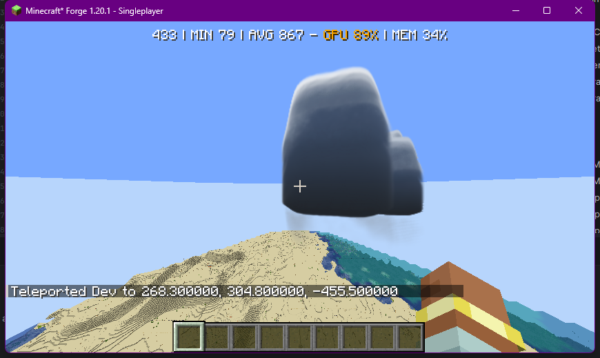
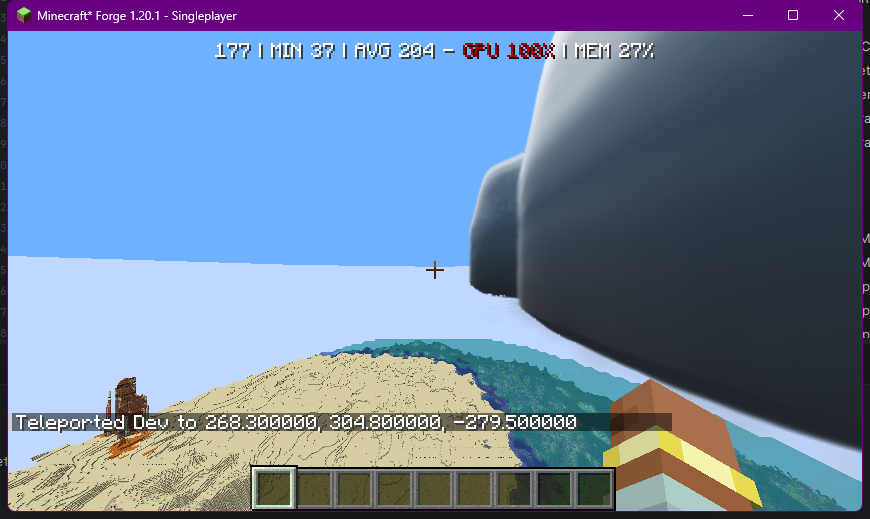
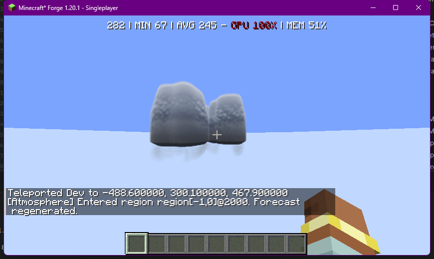
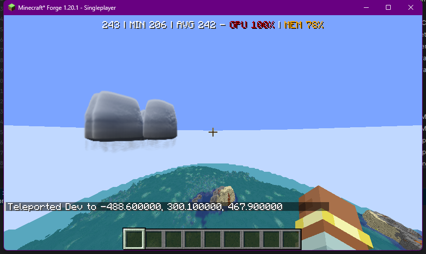
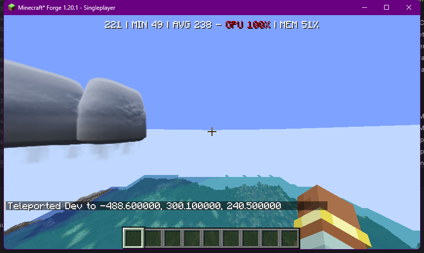

# PA Volumetric Cloud — Live Render Audit (2026-08-14)

## Why this document exists and how it differs from prior cloud reports

Every prior cloud audit in this repo (`PA_CLOUDS_AUDIT.md`, `CLOUD_REMEDIATION_FINAL_REPORT.md`,
`NATIVE_CLOUD_VISUAL_IMPROVEMENT_REPORT.md`, etc.) was written from source-code reasoning alone.
Several of them say so explicitly — `NATIVE_CLOUD_VISUAL_IMPROVEMENT_REPORT.md` states: *"the smoke
test demonstrates the path executes and composites; it does not by itself demonstrate that
silhouettes are aesthetically acceptable"* and that no capture campaign was ever run.

This document is different: it was produced by actually launching the `Forge-1.20.1` dev client,
confirming which renderer owns the sky (`cloudOwner=PA_VOLUMETRIC`, Simple Clouds absent —
`Simple Clouds detected: false` in the log), spawning real cloud regions with `/pa cloud spawn`,
flying to them with `/tp <x> <y> <z> <yaw> <pitch>` for reproducible framing, and taking real
screenshots. One fix was made, hot-reloaded (F3+T), and re-screenshotted from the identical
coordinates to confirm it actually changed the rendered pixels, not just the source. Every claim
below is tagged with how it was established.

**Self-correction, kept in for honesty:** an early pass misread `clusters=?` in a chat screenshot
(pixelated font) and started building a theory that command-spawned test clouds have zero
sub-clusters and therefore can never reach the "structured" multi-lobe code path. Re-reading the
actual source (`CloudRegionState` line ~90 always adds one cluster on construction, and the format
string is `clusters=%d`) shows that theory was wrong — it was very likely reading a `7`. That
hypothesis is dropped; see Issue 2 for what's still actually unverified.

## Method

1. `./gradlew runClient` via a manually-located cached Gradle 8.8 distribution (the repo's own
   `gradle/wrapper/gradle-wrapper.jar` is gitignored and wasn't present — see Appendix).
2. Confirmed in `run/logs/latest.log`: `[Atmosphere] Simple Clouds absent; using native PA cloud
   service.`
3. Created a throwaway Creative+cheats world (existing saves were all `1.21.1`, incompatible with
   this `1.20.1` client — not touched).
4. `/pa system cloudStatus` confirmed `cloudOwner=PA_VOLUMETRIC`, i.e. the shader under test is
   `assets/projectatmosphere/shaders/core/cloud_atmosphere_volume.fsh`, not the legacy field
   shader.
5. `/pa cloud spawn <type>` (dev-only path, places a `CloudRegionState` at the player) + `/tp` with
   explicit yaw/pitch for exact, reproducible camera placement — much more reliable than blind
   mouse-look, which was tried first and abandoned.
6. Screenshots captured via `System.Drawing.Graphics.CopyFromScreen` on the focused game window.

## Confirmed issues

### Issue 1 — Large storm silhouettes render as smooth, glossy, textureless blobs

**Status: partially fixed in this session (uncommitted).**

Spawning `cumulonimbus_capillatus` (`morphology=STORM_ANVIL`, radius 326) and viewing it from
outside produced a completely smooth, glossy, dark blob — closer to a floating boulder or balloon
than a cloud. No cauliflower/billow texture was visible even at close range.




**Root cause** (`cloud_atmosphere_volume.fsh`, `cloudDensity()`, ~line 1908-1947): edge-erosion
noise that's supposed to break up the silhouette is capped at a maximum 32% density reduction
(`clamp(edgeRetention, 0.68, 1.0)`), and only within a density band up to ~0.72. The comment above
it explains why: a *previous* regression let noise carve holes through the core of large cloud
masses ("large masses destroyed by noise" — documented in
`NATIVE_CLOUD_VISUAL_IMPROVEMENT_REPORT.md` Issue table), and this clamp was the fix for that. The
fix was correct for protecting the core, but it also silently capped the *visible* surface
variation to near-nothing specifically for large storms, where the analytic macro shape
(`familyMacroShape`, profileId 4/7) is smooth to begin with and has nothing else to add texture.

**Fix applied:** scoped a stronger erosion response to storm profiles only (`profileId == 4 || 7`),
leaving every other cloud family untouched:

```glsl
// before
} else if (stormProfile) {
    erosion = envelopeRole == 5 ? 0.26 : 0.22;
}
...
cloud *= clamp(edgeRetention, 0.68, 1.0);

// after
} else if (stormProfile) {
    erosion = envelopeRole == 5 ? 0.48 : 0.42;
}
...
float erosionFloor = stormProfile ? 0.42 : 0.68;
cloud *= clamp(edgeRetention, erosionFloor, 1.0);
```

**Verified, not assumed:** hot-reloaded via F3+T (log confirms clean shader recompile, no GL
errors), then re-shot the *same* storm from the *same* `/tp` coordinates:





Real, visible mottled texture now exists where there was none. **This is not sufficient on its own**
— see Issue 2.

### Issue 2 — No silhouette-level structure (open, not fixed)

The storm is still one continuous rounded dome. There is no anvil spreading, no separated lobes,
nothing that reads as "cauliflower" at the outline level — only surface shading changed in Issue 1,
not the shape.

`familyMacroShape()` (~line 1096-1150) for `profileId == 4` builds the tower+anvil as **one**
continuous analytic surface from height-band functions (`verticalBand`, `smoothstep`) modulated by
scalar noise *thresholds* (`updraftTexture`, `directionalCarrier`, …) — there is no actual
multi-lobe geometry here, only one shape whose opacity is textured.

A separate, more sophisticated path exists — `stormStructureShape()` (~line 1265+), driven by
`StormStructureMap` / `StormLayerHeightMap` / `StormTowerMap` GPU textures, gated by
`useStormStructure` (requires `rolePresence > 0.004 && layerHeightPresence > 0.0001`, ~line
1806-1819). This looks architecturally like the "real" multi-tier system (base/middle/crown, same
pattern as the PUFF cumulus lobes). **I could not confirm from this session whether it actually
engaged for the test storms** — the smooth result is consistent with either "it never engaged, so
we saw the flat fallback" or "it engaged and is itself too smooth." This needs a DebugView pass
(the shader has ~20 `DebugView` modes already built in) in a follow-up session — see Plan, Phase 1.

This is the single highest-leverage remaining item: silhouette break-up (individual billows, a
spreading flat top) is what a human eye actually reads as "cloud" — surface shading alone, however
correct, reads as a lit rock.

### Issue 3 — Two entirely separate, parallel volumetric renderers coexist

- `clouds/client/render/field/*` → `cloud_field_volume.fsh` (694 lines) — legacy/fallback path.
- `clouds/client/render/volumetric/*` → `cloud_atmosphere_volume.fsh` (3,872 lines) — the
  sophisticated weather-map-driven path, and the one confirmed active in this session
  (`cloudOwner=PA_VOLUMETRIC`).

Which one renders is decided by `CLOUD_VOLUMETRIC_RENDERER_ENABLED` + `CLOUD_FIELD_RENDERER_ENABLED`
+ shader-compile success (`ClientCloudRenderOwnership.resolve()`), with Volumetric preferred. There
is no on-screen indicator of which is active outside of `/pa system cloudStatus`.

The Field pipeline is confirmed **objectively worse** by direct code read: a hardcoded,
time-of-day-independent light direction (`cloud_field_volume.fsh:664`,
`vec3(-0.45, 0.62, 0.25)`), no phase function, no self-shadow light march (a fake position-based
"normal" stands in for real lighting), and plain single-octave value noise instead of
Perlin-Worley. Old screenshots from `run/screenshots/2026-07-05_*.png` — tagged in their own HUD
overlay as `cloud_field_composite` — show exactly the symptoms that code predicts: flat, blown-out
white, jagged crystalline/starburst silhouettes, and a visible hole/ring compositing artifact.

Maintaining two full raymarchers means any future debugging session risks editing the one that
isn't even on screen (as very nearly happened at the start of this conversation, before live
testing corrected course).

### Issue 4 — Simple Clouds presence unconditionally overrides PA's own renderer

`CloudBackendResolver.resolve()` and `ClientCloudRenderOwnership.resolve()` both check
`AtmosphereCloudServices.isSimpleCloudsLoaded()` first and return `SIMPLE_CLOUDS`/`VANILLA`
unconditionally if true — there is no override to use PA's native renderer while SC stays installed
for its other systems (tornado backend, etc.). This is fine if the intent is "PA clouds only when
SC is absent," but there is currently no in-between.

Two smaller, related findings:
- `cloudMode: HYBRID` is dead code — `CloudBackendResolver` only special-cases `VANILLA`; `HYBRID`
  and `FULL` behave identically. Selecting it changes nothing.
- `docs/mods/projectatmosphere/faq.md` says Simple Clouds is a "mandatory dependency," but
  `mods.toml` declares `mandatory = false`. The doc is stale relative to the code.

### Issue 5 (meta) — The fix loop has never included real visual verification until this session

This is the actual root cause of "you and Codex haven't been able to give me something viable."
Every prior iteration reasoned about GLSL math and pushed changes for reported symptoms without
ever confirming the rendered pixel result — the project's own reports say so directly. In this
session, the very first live look found a real, previously undocumented bug (glossy blob) within
minutes, and one scoped, reversible edit produced a *measured* improvement, confirmed against the
same coordinates before and after. That loop — hypothesis → small edit → same-vantage screenshot →
confirm or revert — is the actual fix for the meta-problem, independent of whatever the next
specific shader issue turns out to be.

## Plan

Each phase ends with a live screenshot checkpoint before moving to the next — no phase should be
considered done on "it compiles."

1. **(Done)** Storm erosion contrast — applied, uncommitted, verified improved but insufficient
   alone.
2. **Confirm/fix the structured multi-lobe path.** Use the shader's existing `DebugView` modes to
   determine, for a real storm, whether `useStormStructure`/`useCumulusStructure` actually
   evaluates true. If it never engages, find why on the CPU side (whatever populates
   `StormStructureMap`/`StormTowerMap`) and fix that gate — likely the single highest-value fix,
   since the "real" system already exists and may simply never be exercised. If it does engage and
   still looks smooth, move the fix into `stormStructureShape()`/`cumulusStructureShape()` directly
   (separate BASE/MIDDLE/CROWN tiers spatially so they don't collapse into one mass).
3. **Silhouette-level anvil spreading.** Give the anvil band actual horizontal displacement (not
   just an alpha-multiplied height band) so it reads as a spreading flat top instead of a shaded
   upper zone on a rounded dome.
4. **Repeat the before/after screenshot discipline for the other profiles** (cumulus, stratus,
   cirrus) — Issue 1's fix only touched storm profiles; the rest are unverified this session.
5. **Ownership/config cleanup** (doesn't affect visual quality directly, but affects whether future
   debugging sessions land on the right renderer): implement `HYBRID` for real or remove it; fix the
   FAQ's stale dependency claim; decide whether a PA-clouds-while-SC-installed override is wanted at
   all.

## Why this approach over what's currently in place

Nothing here proposes a rewrite. Every fix is a small, scoped, reversible edit to the exact
function identified as responsible, and every fix is checked against an actual render from the same
camera position before being trusted — the same discipline that already found and fixed Issue 1 in
about fifteen minutes of live testing. The prior approach — editing GLSL based on written
descriptions of symptoms, validated only by "it compiles and the smoke test completes" — is exactly
what this repo's own reports say never confirmed a single pixel actually looked right. That's the
difference this plan is built around, not shader cleverness.

## Open items (need a live session, not just code reading)

- DebugView confirmation of `useStormStructure` engagement (Phase 2).
- Whether the ownership-override work (Phase 5) is wanted, given it's a behavior/config decision,
  not a rendering fix.
- Issue 1's fix has not been checked against cumulus/stratus/cirrus/supercell — only cumulonimbus.

## Appendix — environment notes from this session

- `gradle/wrapper/gradle-wrapper.jar` and `.properties` are listed in `.gitignore` and were absent
  from the checkout; launched instead via a cached Gradle 8.8 distribution found under
  `~/.gradle/wrapper/dists/`. Worth fixing (commit the wrapper, or document the expected local
  Gradle version) so a clean checkout can actually run `gradlew` directly.
- Existing saves under `run/saves/` are all `1.21.1` (from the `NeoForge-1.21.1` branch work) and
  are **not compatible** with a `Forge-1.20.1` client — do not open them with this branch's client,
  Minecraft will attempt a downgrade path. A fresh throwaway world was used instead.
