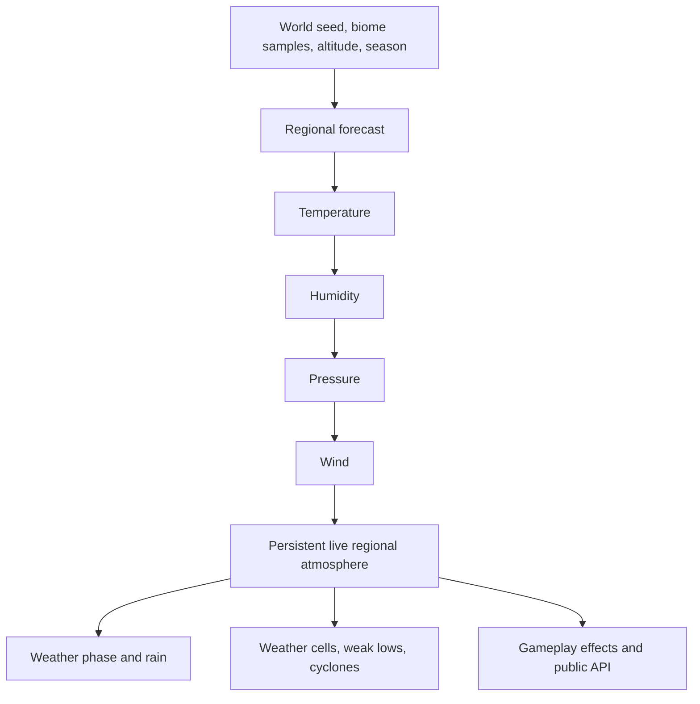

# Project Atmosphere: forecast and atmosphere internals

This document explains how Project Atmosphere (PA) models weather internally. It is written for contributors, modpack authors, server administrators, and anyone who wants to understand what PA is actually simulating.

The description matches the current source tree as of 2026-09-07. When older README text, changelog text, and code disagree, the code is the source of truth.

## Scope

This document covers the forecast engine, the live regional atmosphere, weather progression, severe-weather inputs, persistence, and gameplay-facing limits.

The cloud system is intentionally omitted. Cloud formation, cloud forecasting, cloud identities, and cloud rendering will be documented separately later.

## The basic idea

PA is a procedural regional weather model for Minecraft. It is not a real-world numerical weather prediction model and it does not ingest observations from outside the game.

PA uses two layers:

1. A **forecast baseline** gives each region a seven-day climate curve.
2. A **live atmosphere** evolves around that baseline during play and is saved with the world.

The forecast provides the climate tendency. The live state provides persistence, weather memory, local variation, and interactions between weather systems.

## Regions are the main unit

The runtime maps a world position to a fixed X/Z region. The default region size is 2,000 blocks by 2,000 blocks. A region owns one aggregated forecast and one live atmospheric state.

Forecast generation samples the biome layout at roughly 64-block horizontal intervals, then groups those samples into regions. The resulting temperature, humidity, and pressure curves are weighted averages of the samples. Wind is averaged as a vector, so opposing directions can reduce the regional average speed.

This makes PA much cheaper than simulating every block, but it also means that PA is regional rather than block-scale. A forest, mountain, and desert inside the same region can influence one shared regional forecast. The current default curve sampler does not create a fully continuous microclimate for every block inside that region.

Regions can be loaded from saved files or generated when needed. The first broad generation pass is centred on spawn and covers the configured generation radius. Missing regions can be generated on demand through the region orchestrator.

## How a forecast is generated

The normal dependency order is:

`temperature -> humidity -> pressure -> wind`

### Temperature

Temperature starts with the biome climate and is converted to a Celsius range. PA then applies:

- altitude using a lapse-rate approximation;
- the current season provider and season cycle;
- a day/night temperature curve;
- biome-specific seasonal limits and user overrides;
- position and world-seed variation;
- small daily forecast variation, including occasional heat or cold spikes.

The stored result is seven daily low/high pairs. It is not a full hourly weather record. Consumers sample between the pair for the current in-game day.

### Humidity

Forecast humidity is based mainly on biome downfall and precipitation settings. PA adds a humidity swing derived from the daily temperature range and a small random offset. Tropical and non-precipitating biomes receive special handling so their values do not collapse to the same generic range.

Forecast humidity is represented as a percentage from 0 to 100. The live atmosphere stores the same idea as a normalized value, usually 0 to 1, and exposes it as a percentage when needed. That unit difference matters when reading code or integrating with the API.

### Pressure

Pressure starts with an altitude-adjusted reference value near standard pressure. PA then uses forecast temperature, humidity, and estimated air density to shift the daily pressure range. The result is bounded to safe storage ranges and receives a small generated variation.

The pressure forecast is a target. Runtime pressure can be lower or higher for a while because of rain, pressure systems, ocean influence, wind mixing, and severe weather. A restore term and guard prevent unsupported pressure from drifting without limit.

The region generator currently stores an empty storm-probability week. In practice, storm chance for an initialized region is therefore derived from the live atmosphere rather than from a separate seven-day storm-probability curve.

### Wind

Forecast wind is derived from pressure differences between nearby sampled points. Air density, altitude, biome type, and pressure-gradient direction affect the result. Each forecast day stores a base speed, a direction, and a gust speed.

The runtime wind layer then samples the forecast and applies low/high wind behavior, gust state, storm influence, and limited regional mixing. Wind can also move weather cells and apply configured forces to entities. It is a regional vector field, not a terrain-resolved wind simulation.

## The live atmosphere

When a region is initialized, PA creates a persistent `RegionAtmosphereState` containing values such as:

- temperature in degrees Celsius;
- humidity;
- pressure in hPa;
- wind speed, direction, and gust speed;
- sunlight and seasonal modifiers;
- rain intensity;
- internal moisture and weather-system support values.

The scheduler updates regions at different rates:

- regions within about 1,000 blocks of a player are active and refresh about every 20 ticks;
- other loaded regions are processed in passive batches about every 100 ticks;
- heavy calculations run on the weather executor, while clamped state changes are applied safely on the server thread.

The live state is saved and restored. A server restart therefore resumes the atmosphere instead of rebuilding every region from the first forecast value.

## What PA currently simulates

### Climate and atmospheric fields

PA simulates regional temperature, humidity, pressure, wind, sunlight response, seasonal drift, and limited exchange with neighbouring regions. Wind can mix temperature, humidity, and pressure between the eight adjacent grid cells, with strict per-update limits.

### Moisture and ocean influence

PA tracks a moisture budget for the live atmosphere. The budget includes biome evaporation, rain exchange, forecast restoration, seasonal moisture behavior, wind transport, and ocean-basin influence. Ocean basins are detected from connected ocean-biome regions and maintain long-lived thermal, pressure, and moisture state.

This is a gameplay-oriented moisture reservoir. It is not a full water-cycle or fluid simulation.

### Rain and weather phases

PA derives regional weather phases such as calm, cloudy, rain, thunder, severe, and cyclone from live rain intensity, moisture, pressure, wind, gusts, and storm support. Rain intensity can feed localized world effects such as fire suppression, campfire extinguishing, cauldron filling, precipitation handling, and snow accumulation, subject to configuration and compatibility ownership.

### Weather cells

Weather cells are persistent regional weather objects. The current formation path creates rain cells when humidity, moisture, pressure, coverage, and convergence support are high enough. A cell moves with wind, ages, consumes available moisture, changes intensity and radius, and can weaken or evolve through the supported thunderstorm and supercell lifecycle thresholds.

The cell system is an intermediate weather layer. It is intended to give future severe-weather systems a moving, persistent source instead of making every effect a random event.

### Weak lows and cyclones

Weak low-pressure disturbances can form, persist, move, merge, and influence nearby weather-cell and cyclone support. Cyclones use pressure anomaly, humidity, moisture, convergence, ocean influence, low-pressure organization, and storm support to decide whether a seed is eligible. Active cyclones apply bounded regional changes to pressure, humidity, temperature, rain, and weather coverage, then drift with wind and eventually decay.

Cyclone state is persisted. Formation is still bounded by scan radius, cooldowns, active-system caps, and player-relevant region availability.

### Severe-weather and compatibility systems

The source tree contains tornado, hurricane, sandstorm, snowstorm, fog, storm-shield, and weather-effect systems. They do not all have the same maturity or ownership boundary:

- Cyclones and weather cells are part of the current atmosphere pipeline.
- Tornado and hurricane managers contain real server-side state, movement, effects, persistence, and synchronization, but parts of their normal integration still depend on the external visual weather backend or legacy compatibility paths.
- Sandstorms are optional and depend on the relevant integration being loaded.
- Fog is calculated from humidity, wet-biome factor, and rain intensity.
- Snow accumulation is localized and depends on the current precipitation sample, biome rules, and gamerules.
- Crop stress is exposed as an evaluation API and event. PA does not directly run crop growth or damage from that class.

## What PA does not simulate

PA does not currently provide:

- a three-dimensional atmosphere with vertical pressure, temperature, and wind layers;
- computational fluid dynamics, Navier-Stokes flow, or physically solved fronts and air masses;
- real-world forecast skill, external observations, radar, or climate data ingestion;
- block-by-block terrain wind, shade, shelter, local heat islands, or elevation-resolved microclimates;
- a detailed raindrop, evaporation, runoff, groundwater, soil saturation, or river simulation;
- a complete crop, plant, entity, or ecosystem response model;
- a continuously regenerated forecast based on newly observed live conditions;
- historical weather and alert data through the current public API.

Cloud formation, cloud forecasting, and cloud rendering are also outside this document and are reserved for the later cloud documentation.

## Important limits and failure modes

### The seven-day forecast is a stored baseline

The normal region generator writes seven daily curves to disk. The default sampler cycles through those seven entries. A normal season change changes live targets through seasonal drift; it does not automatically create a brand-new meteorological week. Forecast regeneration is mainly used for missing data, corrupt data recovery, and explicit admin/debug actions.

### Regional resolution is coarse

The 2,000-block default region size is a deliberate performance boundary. Two positions in the same region normally share one live atmospheric state. Neighbour mixing only uses the eight immediately adjacent regions, so distant weather does not create a detailed global circulation map.

### The model is bounded and heuristic

Values are clamped to safe ranges, and most dynamic changes are limited per update. Those limits prevent runaway values and protect server performance, but they also mean that PA may damp a physically plausible extreme or recover from it faster than a real atmosphere would.

### Activity follows players and loaded state

Active updates, candidate scans, weather-cell formation, and some severe-weather decisions are deliberately centred on loaded or player-relevant regions. PA does not maintain an equally detailed, fully ticking simulation over the entire theoretically infinite Minecraft world.

### Some systems still have fallback behavior

If a region is missing or its forecast file fails validation, PA can regenerate it. If generation has no usable samples, the region falls back to neutral values such as approximately 12 °C, 65% humidity, standard pressure, and light wind. These are safety defaults, not a climate conclusion.

### Randomness is mixed with deterministic inputs

Biome position and world seed provide repeatable structure in much of forecast generation. Daily variation, event formation, movement noise, and some fallback paths also use runtime randomness. Regenerating a forecast is therefore not guaranteed to reproduce every previous daily variation exactly.

### Severe weather is not one uniform system yet

The atmosphere, weather-cell, weak-low, and cyclone layers are the clearest current simulation path. Tornadoes, hurricanes, snowstorms, and some visual or compatibility behavior still cross older subsystem boundaries. They should be treated as implemented source features with integration limits rather than as proof that every severe-weather phenomenon is already fully atmosphere-driven.

## Where to inspect the implementation

The main source anchors are:

- `manager/ForecastGenerator.java` — forecast generation and region aggregation;
- `modules/region/ForecastRegion.java` and `DefaultRegionCurves.java` — stored curves and sampling;
- `modules/temperature/util/TemperatureGenerator.java` — temperature forecast construction;
- `modules/humidity/HumidityGenerator.java` — humidity forecast construction;
- `modules/pressure/PressureGenerator.java` — pressure forecast construction;
- `modules/wind/WindGenerator.java` and `modules/wind/WindEngine.java` — forecast and runtime wind;
- `modules/atmosphere/RegionAtmosphereState.java` — persistent live regional state;
- `modules/atmosphere/AtmosphericUpdateScheduler.java` — active/passive runtime updates;
- `modules/weathercell/` — moving weather-cell lifecycle;
- `modules/atmosphere/WeakLowManager.java` and `CycloneManager.java` — low-pressure systems;
- `api/AtmoApi.java` — read-only forecast and current-weather access.

For in-game inspection, the primary commands are `/pa forecast`, `/pa temperature`, `/pa humidity`, `/pa pressure`, `/pa wind`, `/pa status`, and the relevant `/pa debug` commands.
