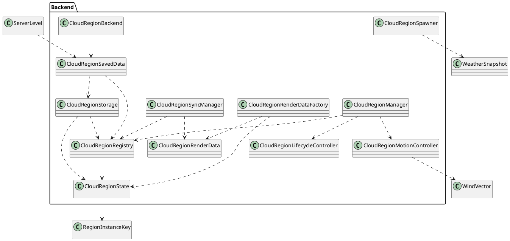

# Backend layout

## Responsabilité du backend

Le backend possède les clouds comme objets logiques.

Il ne fait pas de rendu.

Il ne crée pas de snapshot client.

Il ne connaît pas les hooks Forge client.

Il ne connaît pas les shaders.

## Classes backend actuelles

| Classe | Rôle | Interagit avec | Ne doit pas faire |
|---|---|---|---|
| `CloudRegionState` | Représente un vrai cloud ou une masse de cloud côté serveur | `RegionInstanceKey`, `CloudRegionRegistry`, `CloudRegionStorage`, `CloudRegionRenderDataFactory` | Rendu, packet, shader, client cache |
| `CloudRegionRegistry` | Stocke les `CloudRegionState` actifs et persistants | `CloudRegionState`, `CloudRegionRenderDataFactory`, `CloudRegionSavedData` | Simulation météo, rendu, networking direct |
| `CloudRegionStorage` | Convertit le registry en NBT et recharge le registry depuis NBT | `CloudRegionRegistry`, `CloudRegionState` | Créer des clouds, décider la météo |
| `CloudRegionSavedData` | Branche le storage sur la persistance du monde Minecraft | `CloudRegionStorage`, `CloudRegionRegistry`, `ServerLevel` | Rendu, sync, logique météo |
| `CloudRegionBackend` | Point d’entrée backend propre pour accéder au registry persistant | `CloudRegionSavedData`, `CloudRegionRegistry` | Contenir de la logique complexe |
| `CloudRegionRenderData` | Donnée transportable serveur vers client | `CloudRegionRenderDataFactory`, futur packet, frontend builder | Simulation, persistance monde, rendu |
| `CloudRegionRenderDataFactory` | Convertit `CloudRegionState` en `CloudRegionRenderData` | `CloudRegionState`, `CloudRegionRenderData` | Lire le client, créer un `CloudRenderSnapshot` |

## Classes backend futures

| Classe | Rôle | Interagit avec | Moment |
|---|---|---|---|
| `CloudRegionManager` | Gère la création, update, déplacement, vieillissement et suppression des clouds | `CloudRegionRegistry`, météo PA, vent, pression, humidité | Quand la simulation cloud commence |
| `CloudRegionSpawner` | Décide quand un cloud logique doit naître | `RegionAtmosphereState`, `WeatherSnapshot`, `CloudRegionManager` | Après registry stable |
| `CloudRegionMotionController` | Déplace les clouds avec le vent et garde previous position | `CloudRegionState`, `WindVector` | Avant interpolation client |
| `CloudRegionLifecycleController` | Gère age, lifetime, growth, decay, active false | `CloudRegionState` | Avant sync réel |
| `CloudRegionDensityProfile` | Contient les valeurs backend de densité, coverage, softness, vertical growth | `CloudRegionState`, `CloudRegionRenderDataFactory` | Avant renderer volumétrique |
| `CloudRegionSyncManager` | Envoie les `CloudRegionRenderData` aux clients | `CloudRegionRegistry`, `SyncCloudRegionsPacket` | Quand le frontend live est prêt |

## UML backend



## Backend package recommandé

```text
net.Gabou.projectatmosphere.clouds.backend
    CloudRegionState
    CloudRegionRegistry
    CloudRegionStorage
    CloudRegionSavedData
    CloudRegionBackend
    CloudRegionRenderData
    CloudRegionRenderDataFactory
    CloudRegionManager
    CloudRegionSpawner
    CloudRegionMotionController
    CloudRegionLifecycleController
    CloudRegionSyncManager
```
