# Frontend layout

## Responsabilité du frontend

Le frontend reçoit ou construit des données prêtes pour le rendu.

Il ne simule pas la météo.

Il ne possède pas les clouds serveur.

Il garde les snapshots immutables.

Il prépare le terrain pour le renderer.

## Classes frontend actuelles

| Classe | Rôle | Interagit avec | Ne doit pas faire |
|---|---|---|---|
| `CloudRenderSnapshot` | Snapshot immutable rendu côté client | `CloudRenderSnapshotBuilder`, `CloudRenderStateCache`, `CloudRenderController` | Simulation, packet, shader binding |
| `CloudRenderSnapshotBuilder` | Convertit `CloudRegionRenderData` en `CloudRenderSnapshot` | `CloudRegionRenderData`, contexte client | Lire `CloudRegionState`, dessiner |
| `CloudRenderStateCache` | Stocke `currentSnapshots` et `debugSnapshot` séparément | `CloudRenderStateUpdater`, debug initializer, controller | Mélanger debug et live |
| `CloudRenderStateHolder` | Fournit l’instance du cache | Toutes les classes frontend qui doivent lire ou écrire le cache | Logique métier |
| `CloudRenderStateUpdater` | Écrit les vrais snapshots live dans `currentSnapshots` | `CloudRenderSnapshotBuilder`, `CloudRenderStateCache` | Rendu, debug |
| `CloudRenderController` | Filtre les snapshots live valides pour le renderer | `CloudRenderStateCache`, `CloudRenderSnapshot` | Dessiner, simuler |
| `CloudRenderer` | Point d’entrée du futur rendu live | `CloudRenderController`, futurs render passes | Debug, météo backend |
| `CloudRenderHook` | Hook Forge live qui appelle `CloudRenderer` | `RenderLevelStageEvent`, `CloudRenderer` | Lire le debug snapshot |
| `CloudDebugStateInitializer` | Crée et stocke le snapshot debug | `CloudDebugSnapshotFactory`, `CloudRenderStateCache` | Écrire `currentSnapshots` |
| `CloudDebugSnapshotFactory` | Crée un snapshot fake de debug | `CloudRenderSnapshot` | Lire météo ou backend |
| `CloudDebugRenderHook` | Hook Forge debug seulement | `CloudRenderStateCache`, `CloudWireframeRenderer` | Rendre les vrais clouds |
| `CloudWireframeRenderer` | Dessine une box debug à partir d’un snapshot | `CloudRenderSnapshot`, `PoseStack`, `RenderType.lines` | Rendu réaliste |

## Classes frontend futures

| Classe | Rôle | Interagit avec | Moment |
|---|---|---|---|
| `CloudRenderFrameContext` | Regroupe camera, matrices, worldTime, partialTick, sunDirection | `CloudRenderHook`, `CloudRenderer` | Avant rendu réel |
| `CloudRenderProfile` | Définit Low, Medium, High, Ultra | `CloudRenderer`, `CloudShadowRenderer`, settings | Avant shader |
| `CloudRenderTargetManager` | Gère color target, alpha target, depth target, shadow target | `CloudRenderer`, `CloudShadowRenderer` | Avant volumétrique |
| `CloudDensityProvider` | Donne la densité d’un cloud pour une position monde | `CloudRenderer`, `CloudShadowRenderer`, `CloudLightingBridge` | Phase densité |
| `CloudRaymarchRenderer` | Rend les nuages visibles | `CloudDensityProvider`, shaders, render targets | Phase rendu visible |
| `CloudShadowRenderer` | Génère le cloud shadow map | `CloudDensityProvider`, sun direction, render target | Phase shadows |
| `CloudLightingBridge` | Expose uniforms et textures aux shaders supportés | `CloudShadowRenderer`, `CloudRenderStateCache`, shaders supportés | Phase intégration shaders |
| `FallbackDarkeningPass` | Assombrit localement le terrain ou fog sans shader intégré | `CloudShadowRenderer`, `CloudRenderSnapshot` | Phase fallback |
| `CloudUniformUploader` | Centralise l’envoi des uniforms GPU | `CloudLightingBridge`, shader instances | Phase shaders |
| `CloudRenderDiagnostics` | Affiche stats, nombre de clouds, ms GPU, qualité active | `CloudRenderer`, debug HUD | Phase polish |

## UML frontend

```plantuml
@startuml
package Frontend {
    class CloudRenderSnapshot
    class CloudRenderSnapshotBuilder
    class CloudRenderStateCache
    class CloudRenderStateHolder
    class CloudRenderStateUpdater
    class CloudRenderController
    class CloudRenderer
    class CloudRenderHook
    class CloudRenderFrameContext
    class CloudRenderProfile
    class CloudRenderTargetManager
    class CloudDensityProvider
    class CloudRaymarchRenderer
    class CloudShadowRenderer
    class CloudLightingBridge
    class FallbackDarkeningPass
    class CloudUniformUploader
    class CloudRenderDiagnostics
}

package Debug {
    class CloudDebugSnapshotFactory
    class CloudDebugStateInitializer
    class CloudDebugRenderHook
    class CloudWireframeRenderer
}

class CloudRegionRenderData
class RenderLevelStageEvent
class ShaderInstance
class RenderTarget

CloudRenderSnapshotBuilder ..> CloudRegionRenderData
CloudRenderSnapshotBuilder ..> CloudRenderSnapshot
CloudRenderStateUpdater ..> CloudRenderSnapshotBuilder
CloudRenderStateUpdater ..> CloudRenderStateCache
CloudRenderStateHolder ..> CloudRenderStateCache
CloudRenderController ..> CloudRenderStateCache
CloudRenderController ..> CloudRenderSnapshot
CloudRenderer ..> CloudRenderController
CloudRenderer ..> CloudRenderFrameContext
CloudRenderer ..> CloudRaymarchRenderer
CloudRenderer ..> CloudShadowRenderer
CloudRenderHook ..> RenderLevelStageEvent
CloudRenderHook ..> CloudRenderer

CloudRaymarchRenderer ..> CloudDensityProvider
CloudRaymarchRenderer ..> CloudRenderTargetManager
CloudShadowRenderer ..> CloudDensityProvider
CloudShadowRenderer ..> CloudRenderTargetManager
CloudLightingBridge ..> CloudShadowRenderer
CloudLightingBridge ..> CloudUniformUploader
CloudUniformUploader ..> ShaderInstance
CloudRenderTargetManager ..> RenderTarget
FallbackDarkeningPass ..> CloudDensityProvider
FallbackDarkeningPass ..> CloudRenderTargetManager
CloudRenderDiagnostics ..> CloudRenderer

CloudDebugSnapshotFactory ..> CloudRenderSnapshot
CloudDebugStateInitializer ..> CloudDebugSnapshotFactory
CloudDebugStateInitializer ..> CloudRenderStateCache
CloudDebugRenderHook ..> CloudWireframeRenderer
CloudDebugRenderHook ..> CloudRenderStateCache
CloudWireframeRenderer ..> CloudRenderSnapshot
@enduml
```



## Frontend package recommandé

```text
net.Gabou.projectatmosphere.clouds.frontend
    CloudRenderSnapshot
    CloudRenderSnapshotBuilder
    CloudRenderStateCache
    CloudRenderStateHolder
    CloudRenderStateUpdater
    CloudRenderController
    CloudRenderer
    CloudRenderHook
    CloudRenderFrameContext
    CloudRenderProfile
    CloudRenderTargetManager
    CloudDensityProvider
    CloudRaymarchRenderer
    CloudShadowRenderer
    CloudLightingBridge
    CloudUniformUploader
    FallbackDarkeningPass
    CloudRenderDiagnostics

net.Gabou.projectatmosphere.clouds.frontend.debug
    CloudDebugSnapshotFactory
    CloudDebugStateInitializer
    CloudDebugRenderHook
    CloudWireframeRenderer
```
